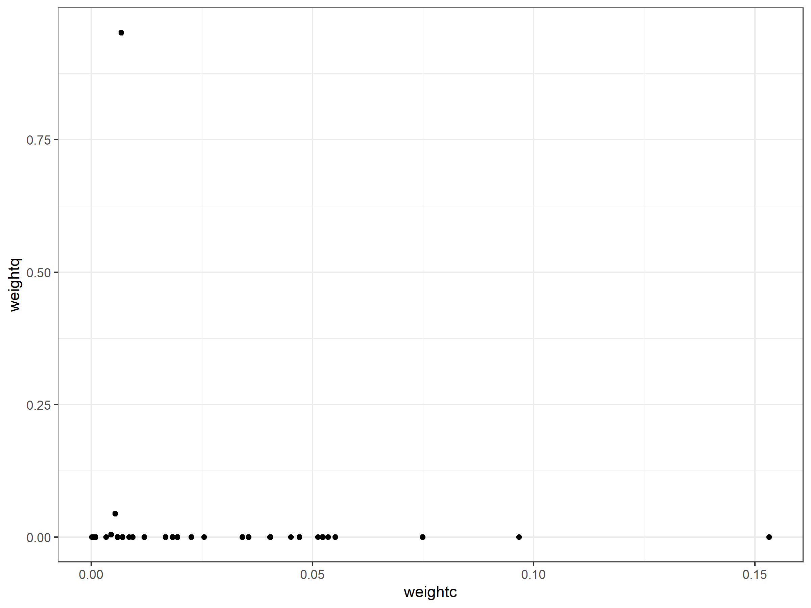

Analysis Template
================
July 23, 2020

  - [Overview](#overview)
  - [Summary of Results](#summary-of-results)
  - [Analyses](#analyses)
      - [Weights comparison](#weights-comparison)
      - [Variable importance](#variable-importance)
      - [Session Information](#session-information)

# Overview

Quabin and the CT FEN data sets each result in different model sets.
This analysis explores whether we can use model weights and variable
importance to get aggregated conclusions from the analysis of the two.

# Summary of Results

  - The two data sets result in totally different model ranks - that is
    partly because Quabin has a clear winning model (with a weight of
    \>90%) while the FEN data’s best model only has a weight of 15%.

# Analyses

## Weights comparison

Plotting the weights from the two data sets. There is little correlation
between them.

<!-- -->

    ## [1] -0.1351908
    ## [1] 0.3061497

Overall, it looks to me like we are on a hiding to nothing in trying to
get an average across the two here. They are so different that I think
our conclusion has to be that there is no one size fits all (boo). That
seems to be a change from the last time I looked at these results in
detail, but perhaps I was just not seeing the patterns.

## Variable importance

We can calculate the importance of each variable by adding up the
weights of the models that contain it. Here, we can do that by adding up
within categores - i.e. compare the sum of weights of models with NDVI
with TCG (etc).

| metric |    imp\_q |    imp\_c |
| :----- | --------: | --------: |
| tcg    | 0.9517979 | 0.2630967 |
| evi    | 0.0045906 | 0.1831750 |
| sr     | 0.0000000 | 0.4953497 |
| ndvi   | 0.0000000 | 0.0529741 |

| harmonic |    imp\_q |    imp\_c |
| :------- | --------: | --------: |
| h13      | 0.9563885 | 0.5804432 |
| h12      | 0.0000000 | 0.4141522 |

| period |    imp\_q |    imp\_c |
| :----- | --------: | --------: |
| full   | 0.9563885 | 0.4026845 |
| 16d    | 0.0000000 | 0.5919109 |

| base      |    imp\_q |    imp\_c |
| :-------- | --------: | --------: |
| 2005-2015 | 0.9563885 | 0.2505279 |
| 2000-2010 | 0.0000000 | 0.7440675 |

This analysis provides a little more insight into why there are
disagreements between the models, but it is still hard to draw general
conclusions. For Quabin, it appears that the best model combines TCG,
h13, 2015 and full - which is no surprise given that is what the best
model includes and that model is the best by a long way (and explains
about 60% of the variation using just the fixed effects). The FEN data
are less clear, which is perhaps unsurprising given that the variable we
are predicting (defoliator abundance) is a little more removed from the
predictor (defoliation). I would probably interpret this as that there
is no clear “right” or “wrong” way of measuring gypsy moth abundance
from the ground - they all do okay (\(R^2 = 0.31\) for the worst
performing model and \(0.45\) for the best).

However, we can say this about the individual metrics. NDVI performs
poorly in both sites - do not use it could be a recommendation, although
that has to be tempered by the 2018 results. The other decisions seem
less impactful.

One thought I had looking at the aggregate results was that the
difference between CT-FEN and Quabin might partly reflect the larger
spatial scope, and hence heterogeniety, of the CT project. There is no
“one-size-fits-all” solution when looking at a variety of forests.

So in terms of recommendations \* There is no single method that works
best in all cases. However, the choice is not critical to the measures
being useful. \* Perhaps avoid NDVI as a metric, although if that is all
you have, that isn’t the end of the world. \* If you are analysing data
from a wide variety of sites, then you might want to use a bunch of
different metrics.

## Session Information

``` 
R version 3.6.3 (2020-02-29)
Platform: x86_64-w64-mingw32/x64 (64-bit)
Running under: Windows 10 x64 (build 17763)

Matrix products: default

locale:
[1] LC_COLLATE=English_United States.1252 
[2] LC_CTYPE=English_United States.1252   
[3] LC_MONETARY=English_United States.1252
[4] LC_NUMERIC=C                          
[5] LC_TIME=English_United States.1252    

attached base packages:
[1] stats     graphics  grDevices utils     datasets  methods   base     

other attached packages:
 [1] ggthemes_4.2.0  cowplot_1.0.0   forcats_0.5.0   stringr_1.4.0  
 [5] dplyr_1.0.0     purrr_0.3.4     readr_1.3.1     tidyr_1.1.0    
 [9] tibble_3.0.1    ggplot2_3.3.0   tidyverse_1.3.0

loaded via a namespace (and not attached):
 [1] tidyselect_1.1.0 xfun_0.12        haven_2.2.0      colorspace_1.4-1
 [5] vctrs_0.3.0      generics_0.0.2   htmltools_0.4.0  yaml_2.2.1      
 [9] rlang_0.4.6      pillar_1.4.4     glue_1.4.1       withr_2.1.2     
[13] DBI_1.1.0        dbplyr_1.4.2     modelr_0.1.6     readxl_1.3.1    
[17] lifecycle_0.2.0  munsell_0.5.0    gtable_0.3.0     cellranger_1.1.0
[21] rvest_0.3.5      codetools_0.2-16 evaluate_0.14    labeling_0.3    
[25] knitr_1.28       fansi_0.4.1      highr_0.8        broom_0.5.3.9000
[29] Rcpp_1.0.4.6     scales_1.1.0     backports_1.1.5  jsonlite_1.6.1  
[33] farver_2.0.3     fs_1.3.2         hms_0.5.3        digest_0.6.25   
[37] stringi_1.4.6    grid_3.6.3       rprojroot_1.3-2  cli_2.0.2       
[41] tools_3.6.3      magrittr_1.5     crayon_1.3.4     pkgconfig_2.0.3 
[45] ellipsis_0.3.1   xml2_1.2.2       reprex_0.3.0     lubridate_1.7.8 
[49] assertthat_0.2.1 rmarkdown_2.1    httr_1.4.1       rstudioapi_0.11 
[53] R6_2.4.1         compiler_3.6.3  
```
