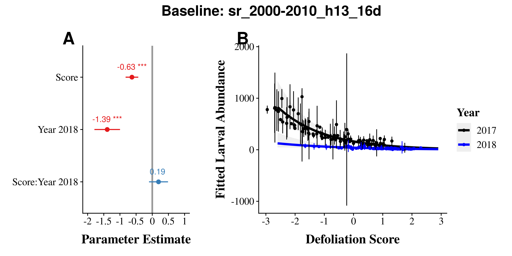
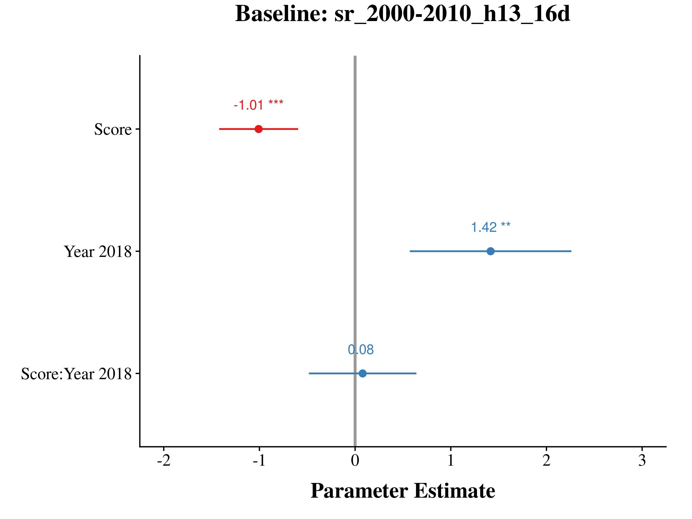
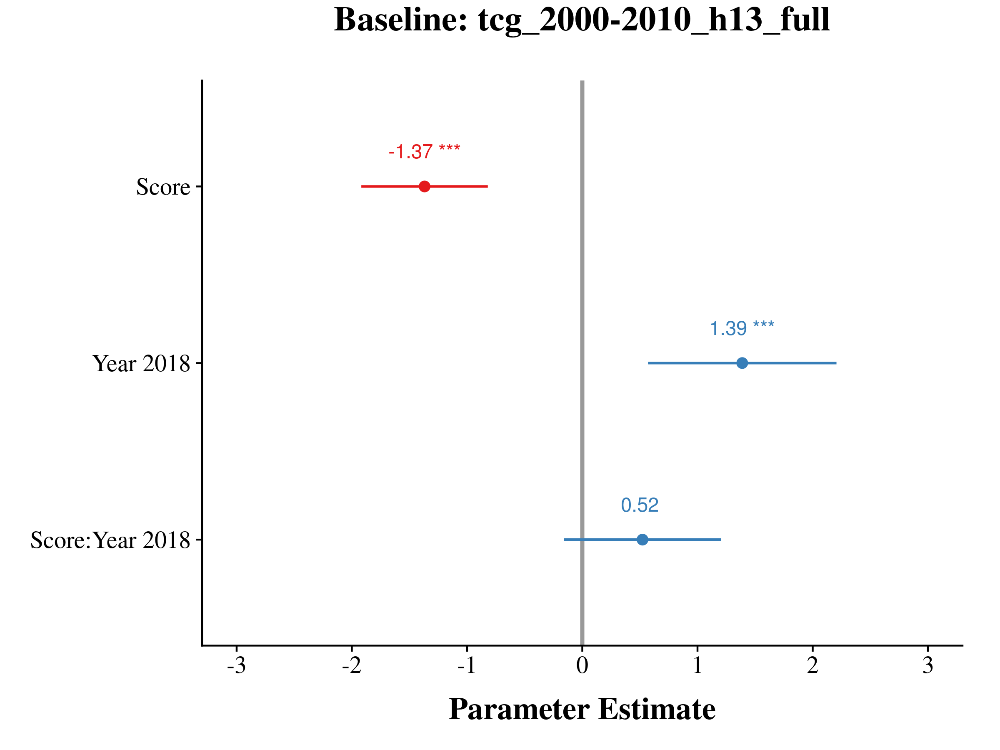
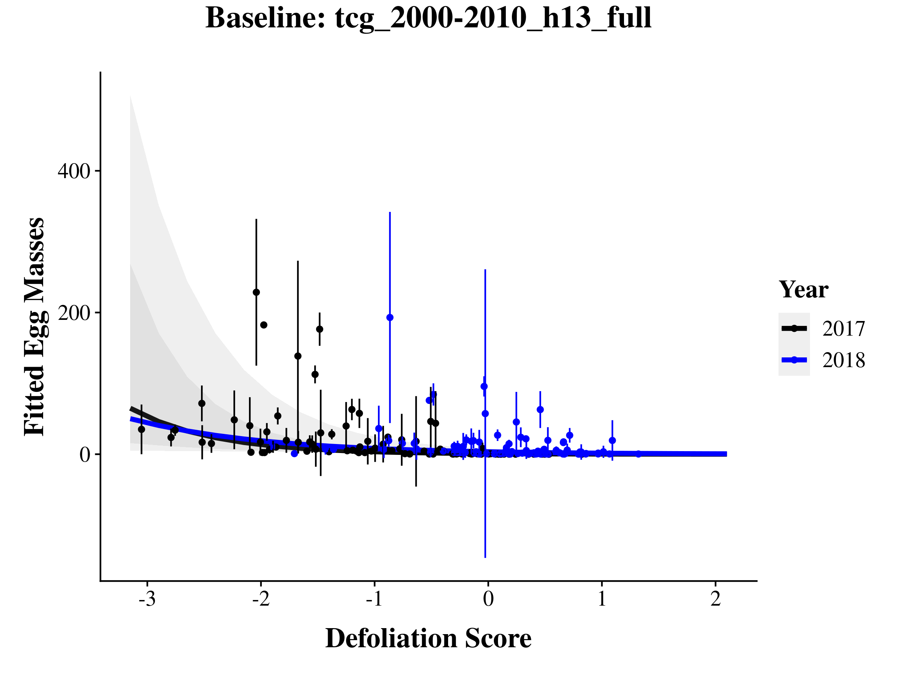
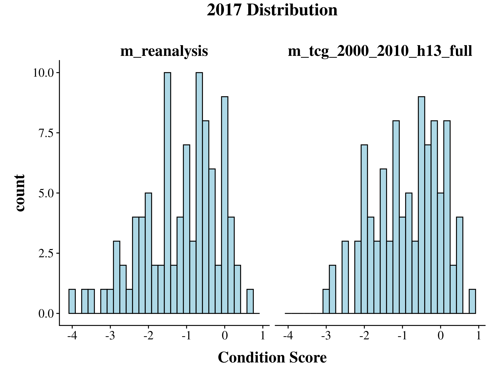
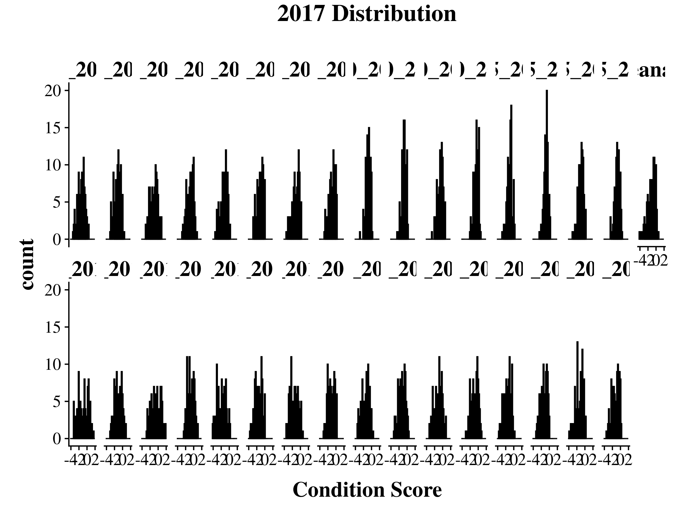

CT Defoliation Model Comparison
================
James Mickley
June 11, 2020

  - [Overview](#overview)
      - [Summary of Results](#summary-of-results)
  - [Burlap Larva](#burlap-larva)
      - [Models](#models)
      - [AIC](#aic)
      - [R2](#r2)
      - [Plots from Top Baselines](#plots-from-top-baselines)
          - [sr\_2000.2010\_h13\_16d](#sr_2000.2010_h13_16d)
          - [tcg\_2000.2010\_h13\_full](#tcg_2000.2010_h13_full)
  - [Egg Mass Models](#egg-mass-models)
      - [AIC](#aic-1)
      - [R2](#r2-1)
      - [Plots from Top Baselines](#plots-from-top-baselines-1)
          - [sr\_2000.2010\_h13\_16d](#sr_2000.2010_h13_16d-1)
          - [tcg\_2000.2010\_h13\_full](#tcg_2000.2010_h13_full-1)
      - [Egg Mass Predictor](#egg-mass-predictor)
          - [AIC](#aic-2)
          - [R2](#r2-2)
          - [Plots](#plots)
  - [Graphs](#graphs)
      - [Compare condition scores between
        baselines](#compare-condition-scores-between-baselines)
      - [Condition Score Distributions](#condition-score-distributions)

## Overview

### Summary of Results

  - 
<!-- end list -->

    'data.frame':   192 obs. of  49 variables:
     $ Year                     : chr  "2017" "2017" "2017" "2017" ...
     $ PointID                  : Factor w/ 117 levels "BB_BBL_5","BB_BBL_6",..: 1 2 3 4 5 6 7 8 9 10 ...
     $ m_paper                  : num  -3.59 -4.15 -4.2 -4.05 -3.41 ...
     $ m_reanalysis             : num  -2.82 -3.71 -3.06 -3.48 -3.12 ...
     $ m_evi_2000.2010_h12_16d  : num  -1.753 -2.038 -1.76 -0.974 -0.889 ...
     $ m_evi_2000.2010_h12_full : num  -1.394 -1.511 -1.604 -0.856 -0.853 ...
     $ m_evi_2000.2010_h13_16d  : num  -1.568 -1.727 -1.593 -0.887 -0.589 ...
     $ m_evi_2000.2010_h13_full : num  -1 -1.188 -1.321 -0.676 -0.574 ...
     $ m_evi_2005.2015_h12_16d  : num  -1.2174 -1.7051 -1.2398 -0.1518 -0.0788 ...
     $ m_evi_2005.2015_h12_full : num  -0.9822 -1.3704 -0.9592 -0.0737 -0.2099 ...
     $ m_evi_2005.2015_h13_16d  : num  -1.121 -1.38 -1.055 -0.124 0.125 ...
     $ m_evi_2005.2015_h13_full : num  -0.87951 -1.18846 -0.80047 0.00104 -0.01878 ...
     $ m_ndvi_2000.2010_h12_16d : num  -1.36 -1.334 -1.333 -1.529 -0.968 ...
     $ m_ndvi_2000.2010_h12_full: num  -1.49 -1.77 -1.46 -1.54 -1.31 ...
     $ m_ndvi_2000.2010_h13_16d : num  -1.319 -1.692 -1.606 -1.506 -0.423 ...
     $ m_ndvi_2000.2010_h13_full: num  -1.451 -1.566 -1.236 -1.333 -0.689 ...
     $ m_ndvi_2005.2015_h12_16d : num  -2.07 -2.12 -1.96 -2.34 -1.83 ...
     $ m_ndvi_2005.2015_h12_full: num  -1.63 -2.16 -1.51 -1.89 -1.41 ...
     $ m_ndvi_2005.2015_h13_16d : num  -2.47 -2.54 -1.98 -2.34 -1.57 ...
     $ m_ndvi_2005.2015_h13_full: num  -1.77 -2.39 -1.95 -1.67 -1.23 ...
     $ m_sr_2000.2010_h12_16d   : num  -2.32 -2.58 -3.03 -2.1 -1.98 ...
     $ m_sr_2000.2010_h12_full  : num  -2.44 -2.65 -3.06 -2.18 -2.22 ...
     $ m_sr_2000.2010_h13_16d   : num  -2.05 -2.23 -2.57 -1.68 -1.32 ...
     $ m_sr_2000.2010_h13_full  : num  -1.91 -2.22 -2.39 -1.62 -1.47 ...
     $ m_sr_2005.2015_h12_16d   : num  -3.43 -4.38 -3.61 -3.23 -2.67 ...
     $ m_sr_2005.2015_h12_full  : num  -2.97 -3.16 -3.2 -3.02 -2.59 ...
     $ m_sr_2005.2015_h13_16d   : num  -3.31 -3.42 -3.33 -3.01 -2.22 ...
     $ m_sr_2005.2015_h13_full  : num  -2.72 -2.97 -2.8 -2.49 -1.97 ...
     $ m_tcg_2000.2010_h12_16d  : num  -3.1 -3.4 -2.95 -1.93 -1.34 ...
     $ m_tcg_2000.2010_h12_full : num  -2.6 -2.94 -3.04 -2.71 -2.23 ...
     $ m_tcg_2000.2010_h13_16d  : num  -2.95 -3.32 -2.55 -2.58 -1.11 ...
     $ m_tcg_2000.2010_h13_full : num  -2.75 -2.99 -2.15 -1.86 -1.32 ...
     $ m_tcg_2005.2015_h12_16d  : num  -2.4 -2.95 -3.07 -2.54 -2.75 ...
     $ m_tcg_2005.2015_h12_full : num  -2.42 -2.98 -2.26 -2.35 -2.15 ...
     $ m_tcg_2005.2015_h13_16d  : num  -3.09 -3.63 -2.92 -2.11 -2.12 ...
     $ m_tcg_2005.2015_h13_full : num  -1.95 -2.46 -2.62 -2 -1.57 ...
     $ BlockID                  : Factor w/ 13 levels "BB","BL","BS",..: 1 1 1 1 1 1 2 2 2 2 ...
     $ SiteID                   : Factor w/ 32 levels "BBL","BBS","BRL",..: 1 1 1 2 2 2 20 20 20 21 ...
     $ FragSize                 : num  388.8 388.8 388.8 26.9 26.9 ...
     $ ForestProp1km            : num  0.71 0.71 0.71 0.751 0.751 0.751 0.655 0.655 0.655 0.59 ...
     $ FragRatio1km             : num  1.81 1.81 1.81 1.5 1.5 ...
     $ Hunted                   : Factor w/ 2 levels "no","yes": 2 2 2 1 1 1 2 2 2 2 ...
     $ BrowseProb               : num  0.14 0.14 0.14 0.165 0.165 0.165 0.193 0.193 0.193 0.177 ...
     $ SiteDefoliation          : num  -2.57 -2.57 -2.57 -2.98 -2.98 ...
     $ EggMasses                : num  2 0 41 97 0 90 19 57 6 1 ...
     $ Abundance                : int  365 328 353 140 173 241 282 354 277 295 ...
     $ Alive                    : int  51 36 47 60 124 60 43 35 51 42 ...
     $ Pathogen                 : int  314 292 306 80 49 181 202 277 182 217 ...
     $ Mortality                : num  0.86 0.89 0.867 0.571 0.283 ...

## Burlap Larva

### Models

### AIC

Here we compare all of the baselines using
[AIC](https://en.wikipedia.org/wiki/Akaike_information_criterion) model
selection.

Models are ranked according to how good they are at predicting Lymantria
abundance from burlap traps.

The column to pay attention to is dAIC, or the difference in AIC between
models. A rule of thumb is that models with a dAIC less than 2 are not
notably different in their quality, and that models within 6 are
similar.

| model                         |     AIC |  dAIC | df | weight |
| :---------------------------- | ------: | ----: | -: | -----: |
| m\_sr\_2000.2010\_h13\_16d    | 2101.33 |  0.00 |  7 |   0.79 |
| m\_sr\_2000.2010\_h12\_16d    | 2105.96 |  4.62 |  7 |   0.08 |
| m\_sr\_2000.2010\_h13\_full   | 2106.30 |  4.97 |  7 |   0.07 |
| m\_sr\_2005.2015\_h13\_full   | 2108.24 |  6.90 |  7 |   0.03 |
| m\_tcg\_2000.2010\_h13\_full  | 2109.83 |  8.50 |  7 |   0.01 |
| m\_sr\_2000.2010\_h12\_full   | 2110.70 |  9.37 |  7 |   0.01 |
| m\_sr\_2005.2015\_h12\_full   | 2111.35 | 10.02 |  7 |   0.01 |
| m\_sr\_2005.2015\_h13\_16d    | 2113.11 | 11.78 |  7 |   0.00 |
| m\_ndvi\_2000.2010\_h13\_16d  | 2113.29 | 11.96 |  7 |   0.00 |
| m\_ndvi\_2000.2010\_h13\_full | 2113.40 | 12.07 |  7 |   0.00 |
| m\_reanalysis                 | 2113.65 | 12.32 |  7 |   0.00 |
| m\_tcg\_2005.2015\_h13\_full  | 2114.90 | 13.57 |  7 |   0.00 |
| m\_ndvi\_2005.2015\_h13\_full | 2115.32 | 13.98 |  7 |   0.00 |
| m\_ndvi\_2000.2010\_h12\_16d  | 2115.36 | 14.03 |  7 |   0.00 |
| m\_ndvi\_2005.2015\_h13\_16d  | 2116.82 | 15.49 |  7 |   0.00 |
| m\_tcg\_2005.2015\_h12\_full  | 2117.39 | 16.06 |  7 |   0.00 |
| m\_tcg\_2000.2010\_h12\_full  | 2118.56 | 17.23 |  7 |   0.00 |
| m\_sr\_2005.2015\_h12\_16d    | 2119.13 | 17.80 |  7 |   0.00 |
| m\_tcg\_2000.2010\_h12\_16d   | 2119.28 | 17.95 |  7 |   0.00 |
| m\_tcg\_2005.2015\_h13\_16d   | 2119.79 | 18.46 |  7 |   0.00 |
| m\_tcg\_2000.2010\_h13\_16d   | 2120.18 | 18.85 |  7 |   0.00 |
| m\_ndvi\_2000.2010\_h12\_full | 2124.46 | 23.13 |  7 |   0.00 |
| m\_ndvi\_2005.2015\_h12\_full | 2125.27 | 23.94 |  7 |   0.00 |
| m\_tcg\_2005.2015\_h12\_16d   | 2125.34 | 24.01 |  7 |   0.00 |
| m\_evi\_2000.2010\_h12\_16d   | 2126.59 | 25.26 |  7 |   0.00 |
| m\_evi\_2005.2015\_h13\_full  | 2128.39 | 27.06 |  7 |   0.00 |
| m\_evi\_2000.2010\_h13\_16d   | 2129.07 | 27.74 |  7 |   0.00 |
| m\_evi\_2005.2015\_h12\_full  | 2129.82 | 28.48 |  7 |   0.00 |
| m\_ndvi\_2005.2015\_h12\_16d  | 2130.28 | 28.95 |  7 |   0.00 |
| m\_evi\_2000.2010\_h12\_full  | 2132.11 | 30.78 |  7 |   0.00 |
| m\_evi\_2000.2010\_h13\_full  | 2132.22 | 30.89 |  7 |   0.00 |
| m\_evi\_2005.2015\_h13\_16d   | 2135.07 | 33.74 |  7 |   0.00 |
| m\_evi\_2005.2015\_h12\_16d   | 2136.86 | 35.53 |  7 |   0.00 |

### R2

Here, we are calculating the proportion of variance in the Lymantria
abundance data that is explained by each model.

We actually get two R2 numbers for these models, a marginal
and a conditional R2:

  - **conditional R2**: the proportion of variance explained
    by the whole model: year, defoliation score, block, and site
  - **marginal R2**: the proportion of variance explained by
    just year and defoliation score (just fixed factors)

In our case, we’re mostly interested in the marginal R2. This
is going to tell us how well that particular defoliation score explains
the abundance of Lymantria.

    Random effect variances not available. Returned R2 does not account for random effects.

| baseline                      | R2\_marginal | R2\_conditional |
| :---------------------------- | -----------: | --------------: |
| m\_sr\_2005.2015\_h12\_full   |         0.74 |              NA |
| m\_sr\_2005.2015\_h13\_full   |         0.67 |            0.77 |
| m\_sr\_2000.2010\_h13\_16d    |         0.66 |            0.79 |
| m\_ndvi\_2005.2015\_h13\_full |         0.65 |            0.75 |
| m\_ndvi\_2005.2015\_h13\_16d  |         0.65 |            0.76 |
| m\_reanalysis                 |         0.65 |            0.76 |
| m\_sr\_2000.2010\_h13\_full   |         0.65 |            0.78 |
| m\_sr\_2000.2010\_h12\_full   |         0.64 |            0.77 |
| m\_sr\_2005.2015\_h13\_16d    |         0.64 |            0.77 |
| m\_sr\_2000.2010\_h12\_16d    |         0.64 |            0.78 |
| m\_ndvi\_2000.2010\_h13\_16d  |         0.63 |            0.76 |
| m\_tcg\_2005.2015\_h13\_full  |         0.63 |            0.76 |
| m\_sr\_2005.2015\_h12\_16d    |         0.63 |            0.75 |
| m\_ndvi\_2005.2015\_h12\_full |         0.63 |            0.73 |
| m\_tcg\_2000.2010\_h13\_full  |         0.62 |            0.76 |
| m\_ndvi\_2000.2010\_h12\_full |         0.62 |            0.74 |
| m\_ndvi\_2000.2010\_h13\_full |         0.62 |            0.77 |
| m\_tcg\_2005.2015\_h13\_16d   |         0.62 |            0.77 |
| m\_ndvi\_2000.2010\_h12\_16d  |         0.62 |            0.76 |
| m\_tcg\_2005.2015\_h12\_16d   |         0.62 |            0.74 |
| m\_tcg\_2005.2015\_h12\_full  |         0.61 |            0.76 |
| m\_tcg\_2000.2010\_h12\_16d   |         0.61 |            0.76 |
| m\_tcg\_2000.2010\_h13\_16d   |         0.60 |            0.76 |
| m\_evi\_2000.2010\_h12\_16d   |         0.60 |            0.74 |
| m\_tcg\_2000.2010\_h12\_full  |         0.60 |            0.76 |
| m\_ndvi\_2005.2015\_h12\_16d  |         0.59 |            0.74 |
| m\_evi\_2000.2010\_h13\_16d   |         0.59 |            0.74 |
| m\_evi\_2005.2015\_h12\_full  |         0.59 |            0.74 |
| m\_evi\_2005.2015\_h13\_full  |         0.58 |            0.75 |
| m\_evi\_2000.2010\_h12\_full  |         0.58 |            0.74 |
| m\_evi\_2000.2010\_h13\_full  |         0.57 |            0.74 |
| m\_evi\_2005.2015\_h13\_16d   |         0.57 |            0.75 |
| m\_evi\_2005.2015\_h12\_16d   |         0.56 |            0.74 |

### Plots from Top Baselines

#### sr\_2000.2010\_h13\_16d

<!-- -->

<!-- -->

<!-- -->

#### tcg\_2000.2010\_h13\_full

<!-- -->

<!-- -->

<!-- -->

## Egg Mass Models

### AIC

| model                         |     AIC |  dAIC | df | weight |
| :---------------------------- | ------: | ----: | -: | -----: |
| m\_sr\_2000.2010\_h13\_16d    | 1043.51 |  0.00 |  7 |   0.49 |
| m\_reanalysis                 | 1045.95 |  2.44 |  7 |   0.14 |
| m\_sr\_2000.2010\_h12\_16d    | 1046.12 |  2.61 |  7 |   0.13 |
| m\_sr\_2000.2010\_h13\_full   | 1046.78 |  3.27 |  7 |   0.10 |
| m\_sr\_2005.2015\_h13\_full   | 1047.08 |  3.57 |  7 |   0.08 |
| m\_sr\_2000.2010\_h12\_full   | 1049.41 |  5.90 |  7 |   0.03 |
| m\_ndvi\_2005.2015\_h13\_full | 1051.26 |  7.75 |  7 |   0.01 |
| m\_sr\_2005.2015\_h12\_full   | 1051.56 |  8.05 |  7 |   0.01 |
| m\_tcg\_2000.2010\_h12\_full  | 1055.36 | 11.85 |  7 |   0.00 |
| m\_ndvi\_2000.2010\_h13\_16d  | 1055.42 | 11.91 |  7 |   0.00 |
| m\_tcg\_2000.2010\_h13\_16d   | 1055.90 | 12.39 |  7 |   0.00 |
| m\_sr\_2005.2015\_h13\_16d    | 1056.10 | 12.59 |  7 |   0.00 |
| m\_ndvi\_2000.2010\_h13\_full | 1056.49 | 12.98 |  7 |   0.00 |
| m\_ndvi\_2005.2015\_h13\_16d  | 1056.52 | 13.01 |  7 |   0.00 |
| m\_tcg\_2005.2015\_h13\_16d   | 1057.43 | 13.92 |  7 |   0.00 |
| m\_tcg\_2005.2015\_h12\_16d   | 1058.01 | 14.50 |  7 |   0.00 |
| m\_tcg\_2000.2010\_h13\_full  | 1059.24 | 15.73 |  7 |   0.00 |
| m\_evi\_2000.2010\_h12\_16d   | 1059.68 | 16.17 |  7 |   0.00 |
| m\_ndvi\_2000.2010\_h12\_full | 1060.35 | 16.84 |  7 |   0.00 |
| m\_tcg\_2000.2010\_h12\_16d   | 1060.66 | 17.15 |  7 |   0.00 |
| m\_ndvi\_2000.2010\_h12\_16d  | 1060.79 | 17.28 |  7 |   0.00 |
| m\_tcg\_2005.2015\_h13\_full  | 1061.62 | 18.11 |  7 |   0.00 |
| m\_tcg\_2005.2015\_h12\_full  | 1061.92 | 18.41 |  7 |   0.00 |
| m\_sr\_2005.2015\_h12\_16d    | 1063.70 | 20.19 |  7 |   0.00 |
| m\_evi\_2000.2010\_h13\_16d   | 1063.75 | 20.24 |  7 |   0.00 |
| m\_evi\_2000.2010\_h12\_full  | 1065.73 | 22.22 |  7 |   0.00 |
| m\_ndvi\_2005.2015\_h12\_16d  | 1065.80 | 22.29 |  7 |   0.00 |
| m\_ndvi\_2005.2015\_h12\_full | 1066.71 | 23.20 |  7 |   0.00 |
| m\_evi\_2000.2010\_h13\_full  | 1070.02 | 26.51 |  7 |   0.00 |
| m\_evi\_2005.2015\_h13\_full  | 1071.10 | 27.59 |  7 |   0.00 |
| m\_evi\_2005.2015\_h12\_full  | 1073.03 | 29.52 |  7 |   0.00 |
| m\_evi\_2005.2015\_h13\_16d   | 1073.25 | 29.74 |  7 |   0.00 |
| m\_evi\_2005.2015\_h12\_16d   | 1074.54 | 31.03 |  7 |   0.00 |

### R2

| baseline                      | R2\_marginal | R2\_conditional |
| :---------------------------- | -----------: | --------------: |
| m\_sr\_2005.2015\_h13\_full   |         0.28 |            0.79 |
| m\_sr\_2000.2010\_h13\_16d    |         0.26 |            0.80 |
| m\_sr\_2000.2010\_h13\_full   |         0.25 |            0.80 |
| m\_sr\_2000.2010\_h12\_16d    |         0.25 |            0.79 |
| m\_sr\_2005.2015\_h12\_full   |         0.24 |            0.78 |
| m\_sr\_2000.2010\_h12\_full   |         0.24 |            0.79 |
| m\_reanalysis                 |         0.19 |            0.81 |
| m\_ndvi\_2005.2015\_h13\_full |         0.18 |            0.81 |
| m\_sr\_2005.2015\_h13\_16d    |         0.17 |            0.78 |
| m\_ndvi\_2005.2015\_h13\_16d  |         0.13 |            0.81 |
| m\_tcg\_2005.2015\_h13\_16d   |         0.13 |            0.81 |
| m\_ndvi\_2000.2010\_h13\_16d  |         0.13 |            0.79 |
| m\_sr\_2005.2015\_h12\_16d    |         0.11 |            0.77 |
| m\_tcg\_2000.2010\_h13\_16d   |         0.11 |            0.80 |
| m\_tcg\_2000.2010\_h12\_full  |         0.11 |            0.79 |
| m\_tcg\_2005.2015\_h12\_16d   |         0.10 |            0.80 |
| m\_ndvi\_2000.2010\_h13\_full |         0.10 |            0.80 |
| m\_tcg\_2000.2010\_h13\_full  |         0.10 |            0.80 |
| m\_tcg\_2000.2010\_h12\_16d   |         0.09 |            0.79 |
| m\_tcg\_2005.2015\_h12\_full  |         0.09 |            0.79 |
| m\_ndvi\_2000.2010\_h12\_full |         0.08 |            0.78 |
| m\_tcg\_2005.2015\_h13\_full  |         0.08 |            0.79 |
| m\_ndvi\_2000.2010\_h12\_16d  |         0.08 |            0.79 |
| m\_ndvi\_2005.2015\_h12\_16d  |         0.07 |            0.79 |
| m\_evi\_2000.2010\_h12\_16d   |         0.06 |            0.82 |
| m\_ndvi\_2005.2015\_h12\_full |         0.06 |            0.79 |
| m\_evi\_2000.2010\_h13\_16d   |         0.05 |            0.81 |
| m\_evi\_2000.2010\_h12\_full  |         0.04 |            0.82 |
| m\_evi\_2005.2015\_h13\_full  |         0.02 |            0.82 |
| m\_evi\_2000.2010\_h13\_full  |         0.02 |            0.81 |
| m\_evi\_2005.2015\_h12\_full  |         0.02 |            0.81 |
| m\_evi\_2005.2015\_h13\_16d   |         0.01 |            0.81 |
| m\_evi\_2005.2015\_h12\_16d   |         0.01 |            0.81 |

### Plots from Top Baselines

#### sr\_2000.2010\_h13\_16d

<!-- -->

<!-- -->

<!-- -->

#### tcg\_2000.2010\_h13\_full

<!-- -->

<!-- -->

<!-- -->

### Egg Mass Predictor

#### AIC

| model                        |     AIC |  dAIC | df | weight |
| :--------------------------- | ------: | ----: | -: | -----: |
| m\_sr\_2000.2010\_h13\_16d   | 2101.33 |  0.00 |  7 |   0.99 |
| m\_tcg\_2000.2010\_h13\_full | 2109.83 |  8.50 |  7 |   0.01 |
| m\_egg.pred                  | 2123.20 | 21.87 |  7 |   0.00 |

#### R2

    Abundance ~ EggMasses * Year + (1 | BlockID/SiteID)
    # R2 for Mixed Models
    
      Conditional R2: 0.760
         Marginal R2: 0.555

#### Plots

<!-- -->

<!-- -->

<!-- -->

## Graphs

Let’s compare the old baseline model (reanalysis) to the new model with
the same parameters (tasseled cap greenness, 2000-2010, h13 harmonics,
full dataset), and see what has changed in the distribution of scores

<!-- -->

<!-- -->

#### Compare condition scores between baselines

Here we are looking at how well condition scores for individual plots
agree between the original reanalysis data product and the new condition
scores.

A lot of scatter means that at a point level, things are substantially
different.

Red lines are slope = 1. In both cases, Val’s new models have less
negative condition scores (values shifted up relative to the reanalysis
ones). There’s not much change in slope, which is good.

<!-- -->

#### Condition Score Distributions

Another interesting comparison is to compare the distribution of
condition scores for the same year between Val’s models

There’s some variation in distribution shape, spread, and how negative
scores are between baselines. NDVI is consistently less negative.

<!-- -->
