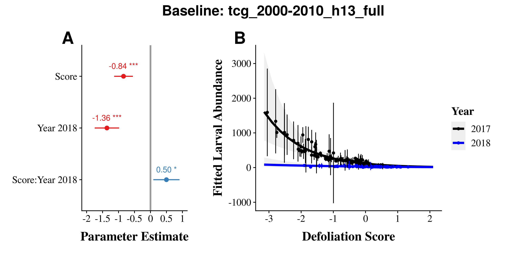
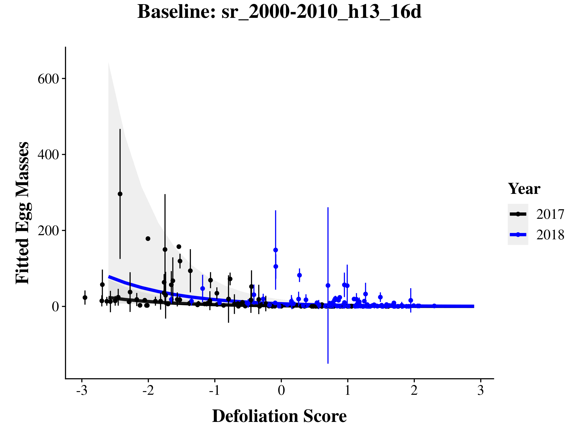
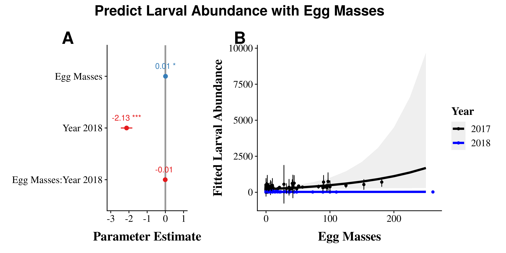

CT Defoliation Model Comparison
================
James Mickley and Audrey Barker Plotkin
June 23, 2020

  - [Overview](#overview)
      - [Summary of Results](#summary-of-results)
  - [Burlap Larva](#burlap-larva)
      - [Models](#models)
      - [AIC](#aic)
      - [R2](#r2)
      - [Plots from Top Baselines](#plots-from-top-baselines)
          - [sr\_2000-2010\_h13\_16d](#sr_2000-2010_h13_16d)
          - [tcg\_2000-2010\_h13\_full](#tcg_2000-2010_h13_full)
  - [Egg Mass Models](#egg-mass-models)
      - [AIC](#aic-1)
      - [R2](#r2-1)
      - [Plots from Top Baselines](#plots-from-top-baselines-1)
          - [sr\_2000-2010\_h13\_16d](#sr_2000-2010_h13_16d-1)
          - [tcg\_2000-2010\_h13\_full](#tcg_2000-2010_h13_full-1)
      - [Egg Mass Predictor](#egg-mass-predictor)
          - [AIC](#aic-2)
          - [R2](#r2-2)
          - [Plots](#plots)
  - [Graphs](#graphs)
      - [Compare condition scores between
        baselines](#compare-condition-scores-between-baselines)
      - [Condition Score Distributions](#condition-score-distributions)

## Overview

This analysis compares Val Pasquarella’s defoliation data from Landsat
satellite to

Here, we examine how varying the following components of the Landsat
change-in-condition model affect how well that predicts defoliation on
the ground: \* Spectral index (TGC, NDVI, SR, EVI) \* Baseline period
(2000-2010, 2005-2015) \* Harmonic periods (12- and -6 month, 12- and
4-month) \* Data included (all available data which varies over time,
consistent 16d interval)

We evaluate the predictive ability of the following: \* Landsat
condition scores predicting larval Lymantria abundance \* Landsat
condition scores predicting Lymantria egg mass abundance \* Egg mass
abundance predicting larval Lymantria abundance

### Summary of Results

  - For both larval abundance and egg masses, the baseline
    sr\_2000\_2010\_h13\_16d is the best predictor
  - All of the best models are SR (top 6 models). NDVI does
  - Condition score can account for 58-67% of the variation in larval
    abundance and 6-32% of the variation in egg masses
  - By comparison, egg masses only predict 55% of the variation in
    larval abundance, and condition scores outperform it as a predictor.
  - Predictive ability of Landsat condition scores weakens in 2018, the
    non-outbreak year, but there is still a pattern.
  - Egg masses only predict larval abundance during the outbreak, no
    relationship in 2018

<!-- end list -->

    'data.frame':   192 obs. of  48 variables:
     $ PointID                  : chr  "BB_BBL_5" "BB_BBL_6" "BB_BBL_7" "BB_BBS_5" ...
     $ Year                     : chr  "2017" "2017" "2017" "2017" ...
     $ m_evi_2000_2010_h12_16d  : num  -1.93 -3 -2.21 -2.46 -2.05 ...
     $ m_evi_2000_2010_h12_full : num  -2.24 -2.55 -2.43 -2.34 -2 ...
     $ m_evi_2000_2010_h13_16d  : num  -1.73 -2.77 -2.23 -2.12 -1.31 ...
     $ m_evi_2000_2010_h13_full : num  -1.95 -2.45 -2.3 -1.93 -1.1 ...
     $ m_evi_2005_2015_h12_16d  : num  -2.62 -3.48 -2.77 -2.58 -2.71 ...
     $ m_evi_2005_2015_h12_full : num  -2.22 -2.87 -2.1 -2.49 -2.17 ...
     $ m_evi_2005_2015_h13_16d  : num  -2.69 -3.59 -2.84 -2.31 -2.12 ...
     $ m_evi_2005_2015_h13_full : num  -2.15 -2.76 -1.99 -2.07 -1.79 ...
     $ m_ndvi_2000_2010_h12_16d : num  -1.44 -1.37 -1.34 -1.63 -1.01 ...
     $ m_ndvi_2000_2010_h12_full: num  -1.58 -1.8 -1.47 -1.64 -1.35 ...
     $ m_ndvi_2000_2010_h13_16d : num  -1.413 -1.725 -1.606 -1.608 -0.466 ...
     $ m_ndvi_2000_2010_h13_full: num  -1.534 -1.593 -1.235 -1.428 -0.727 ...
     $ m_ndvi_2005_2015_h12_16d : num  -2.15 -2.16 -1.96 -2.44 -1.88 ...
     $ m_ndvi_2005_2015_h12_full: num  -1.72 -2.19 -1.52 -1.99 -1.45 ...
     $ m_ndvi_2005_2015_h13_16d : num  -2.57 -2.57 -1.97 -2.44 -1.61 ...
     $ m_ndvi_2005_2015_h13_full: num  -1.87 -2.42 -1.95 -1.77 -1.26 ...
     $ m_reanalysis             : num  -2.82 -3.71 -3.06 -3.48 -3.12 ...
     $ m_sr_2000_2010_h12_16d   : num  -2.43 -2.62 -3.04 -2.15 -1.91 ...
     $ m_sr_2000_2010_h12_full  : num  -2.52 -2.67 -3.07 -2.22 -2.16 ...
     $ m_sr_2000_2010_h13_16d   : num  -2.14 -2.26 -2.58 -1.72 -1.26 ...
     $ m_sr_2000_2010_h13_full  : num  -1.99 -2.24 -2.4 -1.65 -1.41 ...
     $ m_sr_2005_2015_h12_16d   : num  -3.51 -4.41 -3.62 -3.27 -2.6 ...
     $ m_sr_2005_2015_h12_full  : num  -3.04 -3.19 -3.21 -3.05 -2.53 ...
     $ m_sr_2005_2015_h13_16d   : num  -3.38 -3.44 -3.33 -3.05 -2.16 ...
     $ m_sr_2005_2015_h13_full  : num  -2.79 -2.99 -2.8 -2.52 -1.92 ...
     $ m_tcg_2000_2010_h12_16d  : num  -3.27 -3.58 -2.96 -2.03 -1.51 ...
     $ m_tcg_2000_2010_h12_full : num  -2.77 -3.1 -3.06 -2.82 -2.4 ...
     $ m_tcg_2000_2010_h13_16d  : num  -3.13 -3.51 -2.56 -2.69 -1.26 ...
     $ m_tcg_2000_2010_h13_full : num  -2.92 -3.15 -2.16 -1.96 -1.46 ...
     $ m_tcg_2005_2015_h12_16d  : num  -2.57 -3.1 -3.09 -2.64 -2.92 ...
     $ m_tcg_2005_2015_h12_full : num  -2.57 -3.13 -2.27 -2.46 -2.31 ...
     $ m_tcg_2005_2015_h13_16d  : num  -3.26 -3.78 -2.92 -2.21 -2.26 ...
     $ m_tcg_2005_2015_h13_full : num  -2.11 -2.62 -2.62 -2.1 -1.71 ...
     $ BlockID                  : Factor w/ 13 levels "BB","BL","BS",..: 1 1 1 1 1 1 2 2 2 2 ...
     $ SiteID                   : Factor w/ 32 levels "BBL","BBS","BRL",..: 1 1 1 2 2 2 20 20 20 21 ...
     $ FragSize                 : num  388.8 388.8 388.8 26.9 26.9 ...
     $ ForestProp1km            : num  0.71 0.71 0.71 0.751 0.751 0.751 0.655 0.655 0.655 0.59 ...
     $ FragRatio1km             : num  1.81 1.81 1.81 1.5 1.5 ...
     $ Hunted                   : Factor w/ 2 levels "no","yes": 2 2 2 1 1 1 2 2 2 2 ...
     $ BrowseProb               : num  0.14 0.14 0.14 0.165 0.165 0.165 0.193 0.193 0.193 0.177 ...
     $ SiteDefoliation          : num  -2.57 -2.57 -2.57 -2.98 -2.98 ...
     $ EggMasses                : num  2 0 41 97 0 90 19 57 6 1 ...
     $ Abundance                : int  365 328 353 140 173 241 282 354 277 295 ...
     $ Alive                    : int  51 36 47 60 124 60 43 35 51 42 ...
     $ Pathogen                 : int  314 292 306 80 49 181 202 277 182 217 ...
     $ Mortality                : num  0.86 0.89 0.867 0.571 0.283 ...

## Burlap Larva

### Models

### AIC

Here we compare all of the baselines using
[AIC](https://en.wikipedia.org/wiki/Akaike_information_criterion) model
selection.

Models are ranked according to how good they are at predicting Lymantria
abundance from burlap traps.

The column to pay attention to is dAIC, or the difference in AIC between
models. A rule of thumb is that models with a dAIC less than 2 are not
notably different in their quality, and that models within 6 are
similar.

| model                          |     AIC |  dAIC | df | weight |
| :----------------------------- | ------: | ----: | -: | -----: |
| m\_sr\_2000\_2010\_h13\_16d    | 2098.02 |  0.00 |  7 |   0.78 |
| m\_sr\_2000\_2010\_h12\_16d    | 2102.14 |  4.12 |  7 |   0.10 |
| m\_sr\_2000\_2010\_h13\_full   | 2102.91 |  4.89 |  7 |   0.07 |
| m\_sr\_2005\_2015\_h13\_full   | 2104.72 |  6.70 |  7 |   0.03 |
| m\_sr\_2000\_2010\_h12\_full   | 2107.08 |  9.06 |  7 |   0.01 |
| m\_sr\_2005\_2015\_h12\_full   | 2107.33 |  9.30 |  7 |   0.01 |
| m\_sr\_2005\_2015\_h13\_16d    | 2111.14 | 13.11 |  7 |   0.00 |
| m\_ndvi\_2000\_2010\_h13\_full | 2111.52 | 13.49 |  7 |   0.00 |
| m\_ndvi\_2000\_2010\_h13\_16d  | 2111.88 | 13.86 |  7 |   0.00 |
| m\_ndvi\_2005\_2015\_h13\_full | 2112.15 | 14.12 |  7 |   0.00 |
| m\_reanalysis                  | 2113.65 | 15.63 |  7 |   0.00 |
| m\_evi\_2000\_2010\_h13\_full  | 2114.05 | 16.03 |  7 |   0.00 |
| m\_tcg\_2000\_2010\_h13\_full  | 2114.05 | 16.03 |  7 |   0.00 |
| m\_ndvi\_2000\_2010\_h12\_16d  | 2114.30 | 16.28 |  7 |   0.00 |
| m\_ndvi\_2005\_2015\_h13\_16d  | 2114.88 | 16.86 |  7 |   0.00 |
| m\_evi\_2000\_2010\_h12\_full  | 2116.24 | 18.22 |  7 |   0.00 |
| m\_sr\_2005\_2015\_h12\_16d    | 2116.61 | 18.58 |  7 |   0.00 |
| m\_evi\_2005\_2015\_h13\_full  | 2119.13 | 21.10 |  7 |   0.00 |
| m\_evi\_2000\_2010\_h13\_16d   | 2119.28 | 21.26 |  7 |   0.00 |
| m\_tcg\_2005\_2015\_h13\_full  | 2119.30 | 21.27 |  7 |   0.00 |
| m\_evi\_2000\_2010\_h12\_16d   | 2119.74 | 21.72 |  7 |   0.00 |
| m\_evi\_2005\_2015\_h12\_full  | 2121.15 | 23.12 |  7 |   0.00 |
| m\_tcg\_2005\_2015\_h12\_full  | 2121.48 | 23.45 |  7 |   0.00 |
| m\_tcg\_2005\_2015\_h13\_16d   | 2121.54 | 23.52 |  7 |   0.00 |
| m\_evi\_2005\_2015\_h12\_16d   | 2121.82 | 23.80 |  7 |   0.00 |
| m\_tcg\_2000\_2010\_h12\_16d   | 2122.37 | 24.35 |  7 |   0.00 |
| m\_ndvi\_2000\_2010\_h12\_full | 2122.65 | 24.63 |  7 |   0.00 |
| m\_tcg\_2000\_2010\_h12\_full  | 2122.76 | 24.74 |  7 |   0.00 |
| m\_tcg\_2000\_2010\_h13\_16d   | 2122.89 | 24.86 |  7 |   0.00 |
| m\_ndvi\_2005\_2015\_h12\_full | 2123.16 | 25.13 |  7 |   0.00 |
| m\_evi\_2005\_2015\_h13\_16d   | 2123.60 | 25.57 |  7 |   0.00 |
| m\_tcg\_2005\_2015\_h12\_16d   | 2126.91 | 28.89 |  7 |   0.00 |
| m\_ndvi\_2005\_2015\_h12\_16d  | 2128.87 | 30.85 |  7 |   0.00 |

### R2

Here, we are calculating the proportion of variance in the Lymantria
abundance data that is explained by each model.

We actually get two R2 numbers for these models, a marginal
and a conditional R2:

  - **conditional R2**: the proportion of variance explained
    by the whole model: year, defoliation score, block, and site
  - **marginal R2**: the proportion of variance explained by
    just year and defoliation score (just fixed factors)

In our case, we’re mostly interested in the marginal R2. This
is going to tell us how well that particular defoliation score explains
the abundance of Lymantria.

    Random effect variances not available. Returned R2 does not account for random effects.

| baseline                       | R2\_marginal | R2\_conditional |
| :----------------------------- | -----------: | --------------: |
| m\_sr\_2005\_2015\_h12\_full   |         0.74 |              NA |
| m\_sr\_2005\_2015\_h13\_full   |         0.67 |            0.78 |
| m\_sr\_2000\_2010\_h13\_16d    |         0.66 |            0.79 |
| m\_ndvi\_2005\_2015\_h13\_full |         0.66 |            0.76 |
| m\_sr\_2000\_2010\_h13\_full   |         0.65 |            0.79 |
| m\_sr\_2000\_2010\_h12\_full   |         0.65 |            0.78 |
| m\_ndvi\_2005\_2015\_h13\_16d  |         0.65 |            0.76 |
| m\_sr\_2000\_2010\_h12\_16d    |         0.65 |            0.79 |
| m\_reanalysis                  |         0.65 |            0.76 |
| m\_sr\_2005\_2015\_h13\_16d    |         0.64 |            0.77 |
| m\_ndvi\_2005\_2015\_h12\_full |         0.64 |            0.73 |
| m\_ndvi\_2000\_2010\_h13\_16d  |         0.63 |            0.76 |
| m\_ndvi\_2000\_2010\_h12\_full |         0.63 |            0.74 |
| m\_sr\_2005\_2015\_h12\_16d    |         0.63 |            0.76 |
| m\_ndvi\_2000\_2010\_h13\_full |         0.62 |            0.77 |
| m\_ndvi\_2000\_2010\_h12\_16d  |         0.62 |            0.76 |
| m\_evi\_2005\_2015\_h13\_16d   |         0.61 |            0.76 |
| m\_evi\_2005\_2015\_h12\_16d   |         0.61 |            0.76 |
| m\_evi\_2005\_2015\_h12\_full  |         0.61 |            0.76 |
| m\_tcg\_2005\_2015\_h13\_16d   |         0.61 |            0.77 |
| m\_tcg\_2000\_2010\_h13\_full  |         0.61 |            0.76 |
| m\_tcg\_2005\_2015\_h12\_16d   |         0.61 |            0.74 |
| m\_tcg\_2005\_2015\_h13\_full  |         0.61 |            0.76 |
| m\_evi\_2000\_2010\_h12\_full  |         0.60 |            0.77 |
| m\_evi\_2000\_2010\_h12\_16d   |         0.60 |            0.75 |
| m\_evi\_2005\_2015\_h13\_full  |         0.60 |            0.76 |
| m\_evi\_2000\_2010\_h13\_full  |         0.60 |            0.78 |
| m\_evi\_2000\_2010\_h13\_16d   |         0.60 |            0.76 |
| m\_ndvi\_2005\_2015\_h12\_16d  |         0.60 |            0.74 |
| m\_tcg\_2000\_2010\_h12\_16d   |         0.59 |            0.76 |
| m\_tcg\_2000\_2010\_h13\_16d   |         0.59 |            0.76 |
| m\_tcg\_2005\_2015\_h12\_full  |         0.59 |            0.76 |
| m\_tcg\_2000\_2010\_h12\_full  |         0.58 |            0.76 |

### Plots from Top Baselines

#### sr\_2000-2010\_h13\_16d

<!-- -->

<!-- -->

<!-- -->

#### tcg\_2000-2010\_h13\_full

<!-- -->

<!-- -->

<!-- -->

## Egg Mass Models

### AIC

| model                          |     AIC |  dAIC | df | weight |
| :----------------------------- | ------: | ----: | -: | -----: |
| m\_sr\_2000\_2010\_h13\_16d    | 1037.26 |  0.00 |  7 |   0.56 |
| m\_sr\_2000\_2010\_h12\_16d    | 1039.21 |  1.95 |  7 |   0.21 |
| m\_sr\_2000\_2010\_h13\_full   | 1040.64 |  3.38 |  7 |   0.10 |
| m\_sr\_2005\_2015\_h13\_full   | 1041.29 |  4.03 |  7 |   0.07 |
| m\_sr\_2000\_2010\_h12\_full   | 1042.75 |  5.49 |  7 |   0.04 |
| m\_reanalysis                  | 1045.95 |  8.70 |  7 |   0.01 |
| m\_sr\_2005\_2015\_h12\_full   | 1045.98 |  8.73 |  7 |   0.01 |
| m\_ndvi\_2005\_2015\_h13\_full | 1049.10 | 11.85 |  7 |   0.00 |
| m\_evi\_2000\_2010\_h13\_full  | 1052.74 | 15.48 |  7 |   0.00 |
| m\_sr\_2005\_2015\_h13\_16d    | 1052.99 | 15.73 |  7 |   0.00 |
| m\_evi\_2000\_2010\_h13\_16d   | 1053.12 | 15.87 |  7 |   0.00 |
| m\_ndvi\_2000\_2010\_h13\_16d  | 1054.22 | 16.96 |  7 |   0.00 |
| m\_ndvi\_2000\_2010\_h13\_full | 1054.87 | 17.61 |  7 |   0.00 |
| m\_ndvi\_2005\_2015\_h13\_16d  | 1055.23 | 17.97 |  7 |   0.00 |
| m\_evi\_2000\_2010\_h12\_full  | 1056.07 | 18.82 |  7 |   0.00 |
| m\_evi\_2005\_2015\_h12\_16d   | 1056.17 | 18.92 |  7 |   0.00 |
| m\_tcg\_2000\_2010\_h12\_full  | 1056.46 | 19.20 |  7 |   0.00 |
| m\_evi\_2005\_2015\_h13\_16d   | 1056.54 | 19.29 |  7 |   0.00 |
| m\_tcg\_2005\_2015\_h12\_16d   | 1056.63 | 19.37 |  7 |   0.00 |
| m\_tcg\_2000\_2010\_h13\_16d   | 1056.78 | 19.52 |  7 |   0.00 |
| m\_tcg\_2005\_2015\_h13\_16d   | 1056.79 | 19.54 |  7 |   0.00 |
| m\_ndvi\_2000\_2010\_h12\_full | 1058.49 | 21.23 |  7 |   0.00 |
| m\_evi\_2000\_2010\_h12\_16d   | 1059.07 | 21.81 |  7 |   0.00 |
| m\_ndvi\_2000\_2010\_h12\_16d  | 1059.28 | 22.02 |  7 |   0.00 |
| m\_tcg\_2000\_2010\_h13\_full  | 1059.90 | 22.64 |  7 |   0.00 |
| m\_tcg\_2000\_2010\_h12\_16d   | 1060.03 | 22.77 |  7 |   0.00 |
| m\_sr\_2005\_2015\_h12\_16d    | 1060.78 | 23.53 |  7 |   0.00 |
| m\_evi\_2005\_2015\_h12\_full  | 1061.46 | 24.20 |  7 |   0.00 |
| m\_evi\_2005\_2015\_h13\_full  | 1061.89 | 24.63 |  7 |   0.00 |
| m\_tcg\_2005\_2015\_h13\_full  | 1062.09 | 24.83 |  7 |   0.00 |
| m\_tcg\_2005\_2015\_h12\_full  | 1062.24 | 24.99 |  7 |   0.00 |
| m\_ndvi\_2005\_2015\_h12\_16d  | 1065.02 | 27.76 |  7 |   0.00 |
| m\_ndvi\_2005\_2015\_h12\_full | 1065.46 | 28.20 |  7 |   0.00 |

### R2

| baseline                       | R2\_marginal | R2\_conditional |
| :----------------------------- | -----------: | --------------: |
| m\_sr\_2005\_2015\_h13\_full   |         0.32 |            0.80 |
| m\_sr\_2000\_2010\_h13\_16d    |         0.30 |            0.81 |
| m\_sr\_2000\_2010\_h13\_full   |         0.29 |            0.81 |
| m\_sr\_2000\_2010\_h12\_16d    |         0.29 |            0.80 |
| m\_sr\_2000\_2010\_h12\_full   |         0.29 |            0.81 |
| m\_sr\_2005\_2015\_h12\_full   |         0.28 |            0.79 |
| m\_reanalysis                  |         0.19 |            0.81 |
| m\_ndvi\_2005\_2015\_h13\_full |         0.19 |            0.81 |
| m\_sr\_2005\_2015\_h13\_16d    |         0.18 |            0.78 |
| m\_ndvi\_2005\_2015\_h13\_16d  |         0.14 |            0.81 |
| m\_evi\_2000\_2010\_h13\_full  |         0.13 |            0.81 |
| m\_sr\_2005\_2015\_h12\_16d    |         0.13 |            0.78 |
| m\_ndvi\_2000\_2010\_h13\_16d  |         0.13 |            0.79 |
| m\_tcg\_2005\_2015\_h13\_16d   |         0.13 |            0.81 |
| m\_evi\_2000\_2010\_h13\_16d   |         0.13 |            0.80 |
| m\_evi\_2005\_2015\_h12\_16d   |         0.12 |            0.80 |
| m\_evi\_2005\_2015\_h13\_16d   |         0.12 |            0.81 |
| m\_evi\_2000\_2010\_h12\_full  |         0.11 |            0.80 |
| m\_tcg\_2005\_2015\_h12\_16d   |         0.11 |            0.81 |
| m\_ndvi\_2000\_2010\_h13\_full |         0.11 |            0.80 |
| m\_tcg\_2000\_2010\_h12\_full  |         0.10 |            0.80 |
| m\_tcg\_2000\_2010\_h13\_16d   |         0.10 |            0.80 |
| m\_ndvi\_2000\_2010\_h12\_full |         0.10 |            0.79 |
| m\_tcg\_2000\_2010\_h12\_16d   |         0.09 |            0.79 |
| m\_ndvi\_2000\_2010\_h12\_16d  |         0.09 |            0.79 |
| m\_evi\_2000\_2010\_h12\_16d   |         0.09 |            0.79 |
| m\_evi\_2005\_2015\_h12\_full  |         0.09 |            0.79 |
| m\_tcg\_2000\_2010\_h13\_full  |         0.09 |            0.80 |
| m\_evi\_2005\_2015\_h13\_full  |         0.08 |            0.80 |
| m\_tcg\_2005\_2015\_h12\_full  |         0.08 |            0.79 |
| m\_tcg\_2005\_2015\_h13\_full  |         0.08 |            0.80 |
| m\_ndvi\_2005\_2015\_h12\_16d  |         0.07 |            0.79 |
| m\_ndvi\_2005\_2015\_h12\_full |         0.06 |            0.79 |

### Plots from Top Baselines

#### sr\_2000-2010\_h13\_16d

<!-- -->

<!-- -->

<!-- -->

#### tcg\_2000-2010\_h13\_full

<!-- -->

<!-- -->

<!-- -->

### Egg Mass Predictor

#### AIC

| model                             |     AIC |  dAIC | df | weight |
| :-------------------------------- | ------: | ----: | -: | -----: |
| m\_sr\_2000-2010\_h13\_16d        | 2098.02 |  0.00 |  7 |      1 |
| m\_tcg\_2000-2010\_h13\_full      | 2114.05 | 16.03 |  7 |      0 |
| Predict abundance with egg masses | 2123.20 | 25.18 |  7 |      0 |

#### R2

    Abundance ~ EggMasses * Year + (1 | BlockID/SiteID)
    # R2 for Mixed Models
    
      Conditional R2: 0.760
         Marginal R2: 0.555

#### Plots

<!-- -->

<!-- -->

<!-- -->

## Graphs

Let’s compare the old baseline model (reanalysis) to the new model with
the same parameters (tasseled cap greenness, 2000-2010, h13 harmonics,
full dataset), and see what has changed in the distribution of scores

<!-- -->

<!-- -->

#### Compare condition scores between baselines

Here we are looking at how well condition scores for individual plots
agree between the original reanalysis data product and the new condition
scores.

A lot of scatter means that at a point level, things are substantially
different.

Red lines are slope = 1. In both cases, Val’s new models have less
negative condition scores (values shifted up relative to the reanalysis
ones). There’s not much change in slope, which is good.

<!-- -->

#### Condition Score Distributions

Another interesting comparison is to compare the distribution of
condition scores for the same year between Val’s models

There’s some variation in distribution shape, spread, and how negative
scores are between baselines. NDVI is consistently less negative.

<!-- -->
