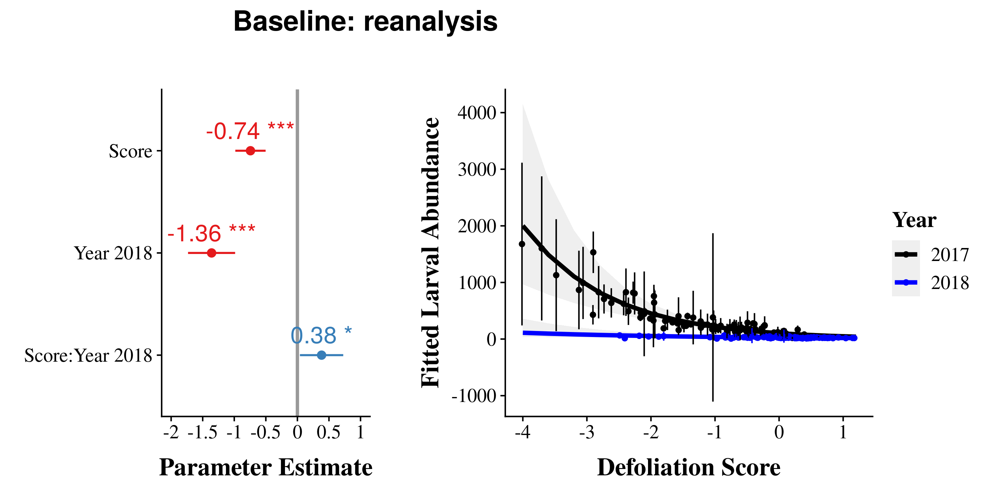
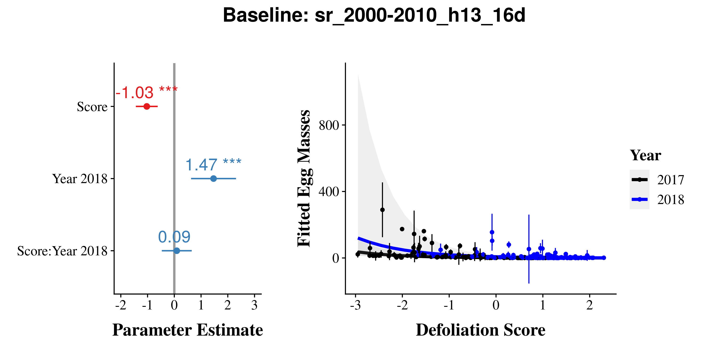
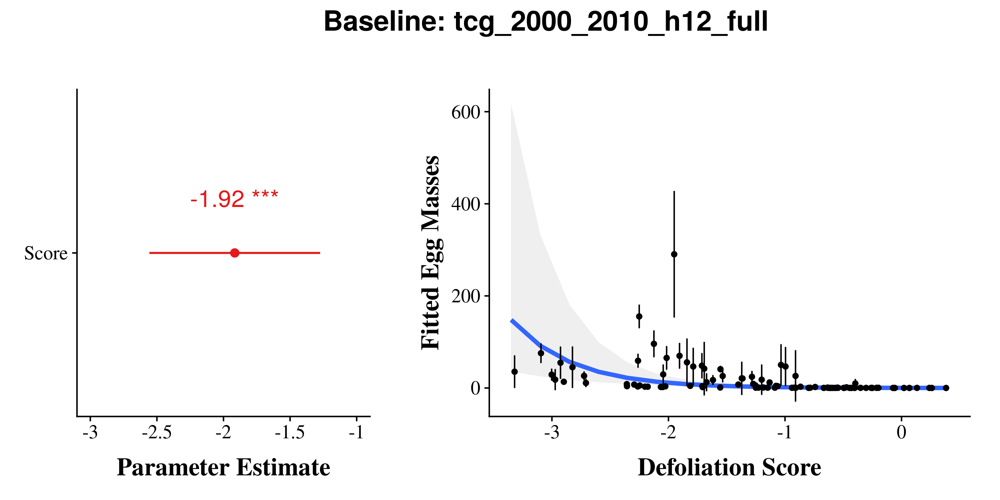
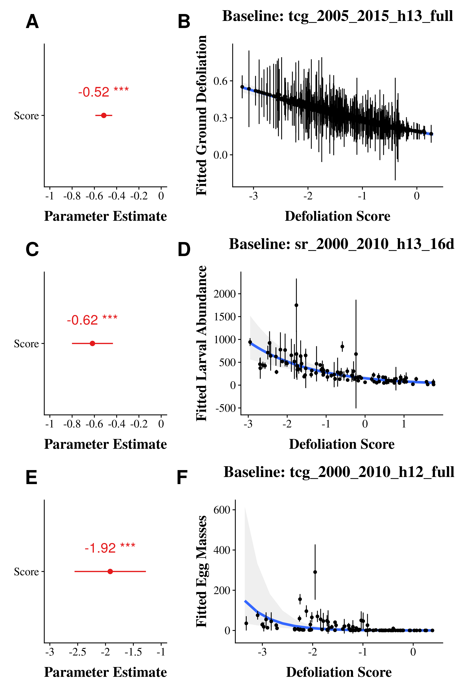

Defoliation Model Comparison
================
James Mickley and Audrey Barker Plotkin
July 29, 2020


  - [Overview](#overview)
      - [Summary of Results](#summary-of-results)
  - [Quabbin](#quabbin)
      - [Models](#models)
      - [AIC](#aic)
      - [R<sup>2</sup>](#r2)
      - [Plots from Top Baselines](#plots-from-top-baselines)
          - [Top Quabbin Baseline:
            tcg\_2005\_2015\_h13\_full](#top-quabbin-baseline-tcg_2005_2015_h13_full)
          - [Consensus Baseline:
            reanalysis](#consensus-baseline-reanalysis)
  - [CT Burlap Larva](#ct-burlap-larva)
      - [Models](#models-1)
      - [AIC](#aic-1)
          - [Both Years](#both-years)
          - [2017 Only](#only)
          - [2018 Only](#only-1)
      - [R<sup>2</sup>](#r2-1)
          - [2017 Only](#only-2)
          - [2018 Only](#only-3)
      - [Plots from Top Baselines
        (2017/2018)](#plots-from-top-baselines-20172018)
          - [Top Burlap Baseline:
            ndvi\_2000\_2010\_h13\_16d](#top-burlap-baseline-ndvi_2000_2010_h13_16d)
          - [Consensus Baseline:
            reanalysis](#consensus-baseline-reanalysis-1)
      - [Plots from Top Baselines (2017
        only)](#plots-from-top-baselines-2017-only)
          - [Top Burlap Baseline:
            sr\_2000\_2010\_h13\_16d](#top-burlap-baseline-sr_2000_2010_h13_16d)
          - [Consensus Baseline:](#consensus-baseline)
  - [Egg Mass Models](#egg-mass-models)
      - [AIC](#aic-2)
          - [Both Years](#both-years-1)
          - [2017 Only](#only-4)
          - [2018 Only](#only-5)
      - [R<sup>2</sup>](#r2-2)
          - [2017 Only](#only-6)
          - [2018 Only](#only-7)
      - [Plots from Top Baselines
        (2017/2018)](#plots-from-top-baselines-20172018-1)
          - [Top Egg Mass Baseline:
            sr\_2000-2010\_h13\_16d](#top-egg-mass-baseline-sr_2000-2010_h13_16d)
          - [Consensus Baseline:](#consensus-baseline-1)
      - [Plots from Top Baselines (2017
        only)](#plots-from-top-baselines-2017-only-1)
      - [Top Egg Mass Baseline:
        tcg\_2000\_2010\_h12\_full](#top-egg-mass-baseline-tcg_2000_2010_h12_full)
          - [Consensus Baseline:](#consensus-baseline-2)
  - [Egg Mass Predictor](#egg-mass-predictor)
      - [AIC](#aic-3)
          - [Both Years](#both-years-2)
          - [2017 Only](#only-8)
          - [2018 Only](#only-9)
      - [R<sup>2</sup>](#r2-3)
          - [Both Years](#both-years-3)
          - [2017 Only](#only-10)
          - [2018 Only](#only-11)
      - [Plots](#plots)
          - [Both Years](#both-years-4)
          - [2017 Only](#only-12)
  - [Combined Panel Plots](#combined-panel-plots)
      - [Top](#top)
      - [Consensus](#consensus)
      - [Graphs](#graphs)

## Overview

This analysis compares Val Pasquarella’s defoliation data from Landsat
satellite to the following:

1.  Defoliation data collected in late September 2017 from 483 points
    within 6 ‘hotspots’ in the Quabbin Watershed Forest (Rich MacLean,
    DCR Watershed Forester field data lead).
2.  Lymantria larval and egg mass abundance data collected in 2017 and
    2018 from 12 trees each in 32 forest fragments of varying size in
    Eastern Connecticut.

Here, we examine how varying the following components of the Landsat
change-in-condition model affect how well that predicts defoliation or
Lymantria abundance on the ground:

  - Spectral index (TGC, NDVI, SR, EVI)
  - Baseline period (2000-2010, 2005-2015)
  - Harmonic periods (12- and -6 month, 12- and 4-month)
  - Data included (all available data which varies over time, consistent
    16d interval)

We evaluate the predictive ability of the following: \* Landsat
condition scores predicting the proportion of canopy defoliated \*
Landsat condition scores predicting larval Lymantria abundance \*
Landsat condition scores predicting Lymantria egg mass abundance \* Egg
mass abundance predicting larval Lymantria abundance

### Summary of Results

  - For both larval abundance and egg masses, the baseline
    sr\_2000\_2010\_h13\_16d is the best predictor
  - All of the best models are SR (top 6 models). NDVI does
  - Condition score can account for 58-67% of the variation in larval
    abundance and 6-32% of the variation in egg masses
  - By comparison, egg masses only predict 55% of the variation in
    larval abundance, and condition scores outperform it as a predictor.
  - Predictive ability of Landsat condition scores weakens in 2018, the
    non-outbreak year, but there is still a pattern.
  - Egg masses only predict larval abundance during the outbreak, no
    relationship in 2018

Forest Condition Assessment - Github

## Quabbin

### Models

### AIC

Here we compare all of the baselines using
[AIC](https://en.wikipedia.org/wiki/Akaike_information_criterion) model
selection.

Models are ranked according to how good they are at predicting canopy
defoliation.

The column to pay attention to is dAIC, or the difference in AIC between
models. A rule of thumb is that models with a dAIC less than 2 are not
notably different in their quality, and that models within 6 are
similar.

| model                          |      AIC |   dAIC | df | weight |
| :----------------------------- | -------: | -----: | -: | -----: |
| m\_tcg\_2005\_2015\_h13\_full  | \-687.86 |   0.00 |  4 |   0.95 |
| m\_reanalysis                  | \-681.69 |   6.17 |  4 |   0.04 |
| m\_evi\_2005\_2015\_h13\_full  | \-677.19 |  10.67 |  4 |   0.00 |
| m\_tcg\_2005\_2015\_h13\_16d   | \-653.95 |  33.90 |  4 |   0.00 |
| m\_tcg\_2005\_2015\_h12\_full  | \-651.38 |  36.48 |  4 |   0.00 |
| m\_tcg\_2000\_2010\_h13\_full  | \-647.89 |  39.96 |  4 |   0.00 |
| m\_sr\_2000\_2010\_h12\_16d    | \-645.60 |  42.26 |  4 |   0.00 |
| m\_sr\_2000\_2010\_h13\_16d    | \-644.92 |  42.93 |  4 |   0.00 |
| m\_tcg\_2000\_2010\_h13\_16d   | \-644.62 |  43.23 |  4 |   0.00 |
| m\_evi\_2005\_2015\_h13\_16d   | \-644.11 |  43.75 |  4 |   0.00 |
| m\_evi\_2005\_2015\_h12\_full  | \-643.58 |  44.27 |  4 |   0.00 |
| m\_evi\_2000\_2010\_h13\_full  | \-631.06 |  56.80 |  4 |   0.00 |
| m\_evi\_2000\_2010\_h13\_16d   | \-627.33 |  60.53 |  4 |   0.00 |
| m\_sr\_2000\_2010\_h13\_full   | \-626.61 |  61.25 |  4 |   0.00 |
| m\_sr\_2000\_2010\_h12\_full   | \-625.84 |  62.02 |  4 |   0.00 |
| m\_ndvi\_2005\_2015\_h13\_full | \-623.91 |  63.94 |  4 |   0.00 |
| m\_tcg\_2000\_2010\_h12\_full  | \-622.31 |  65.55 |  4 |   0.00 |
| m\_tcg\_2005\_2015\_h12\_16d   | \-617.21 |  70.65 |  4 |   0.00 |
| m\_tcg\_2000\_2010\_h12\_16d   | \-615.55 |  72.30 |  4 |   0.00 |
| m\_evi\_2005\_2015\_h12\_16d   | \-612.69 |  75.17 |  4 |   0.00 |
| m\_sr\_2005\_2015\_h13\_full   | \-609.01 |  78.85 |  4 |   0.00 |
| m\_sr\_2005\_2015\_h13\_16d    | \-607.97 |  79.88 |  4 |   0.00 |
| m\_sr\_2005\_2015\_h12\_16d    | \-604.16 |  83.69 |  4 |   0.00 |
| m\_evi\_2000\_2010\_h12\_full  | \-602.13 |  85.73 |  4 |   0.00 |
| m\_sr\_2005\_2015\_h12\_full   | \-601.03 |  86.83 |  4 |   0.00 |
| m\_evi\_2000\_2010\_h12\_16d   | \-598.74 |  89.12 |  4 |   0.00 |
| m\_ndvi\_2005\_2015\_h13\_16d  | \-593.56 |  94.30 |  4 |   0.00 |
| m\_ndvi\_2000\_2010\_h13\_16d  | \-585.95 | 101.91 |  4 |   0.00 |
| m\_ndvi\_2000\_2010\_h13\_full | \-585.14 | 102.72 |  4 |   0.00 |
| m\_ndvi\_2005\_2015\_h12\_full | \-584.38 | 103.48 |  4 |   0.00 |
| m\_ndvi\_2000\_2010\_h12\_16d  | \-574.99 | 112.87 |  4 |   0.00 |
| m\_ndvi\_2000\_2010\_h12\_full | \-573.68 | 114.18 |  4 |   0.00 |
| m\_ndvi\_2005\_2015\_h12\_16d  | \-556.78 | 131.08 |  4 |   0.00 |

### R<sup>2</sup>

Here, we are calculating the proportion of variance in the defoliation
that is explained by each model.

We actually get two R<sup>2</sup> numbers for these models, a marginal
and a conditional R<sup>2</sup> (using the method from [Nakagawa &
Schielzeth 2013](https://doi.org/10.1111/j.2041-210x.2012.00261.x)):

  - **conditional R<sup>2</sup>**: the proportion of variance explained
    by the whole model: defoliation score, and hotplot
  - **marginal R<sup>2</sup>**: the proportion of variance explained by
    just defoliation score (just fixed factors)

In our case, we’re mostly interested in the marginal R<sup>2</sup>. This
is going to tell us how well that particular defoliation score explains
the canopy defoliation.

| baseline                       | R2\_marginal | R2\_conditional |
| :----------------------------- | -----------: | --------------: |
| m\_tcg\_2005\_2015\_h13\_full  |         0.60 |            0.63 |
| m\_reanalysis                  |         0.59 |            0.64 |
| m\_evi\_2005\_2015\_h13\_full  |         0.57 |            0.61 |
| m\_tcg\_2005\_2015\_h13\_16d   |         0.55 |            0.58 |
| m\_tcg\_2000\_2010\_h13\_full  |         0.55 |            0.57 |
| m\_tcg\_2000\_2010\_h13\_16d   |         0.54 |            0.59 |
| m\_tcg\_2005\_2015\_h12\_full  |         0.53 |            0.57 |
| m\_evi\_2005\_2015\_h13\_16d   |         0.52 |            0.55 |
| m\_evi\_2000\_2010\_h13\_full  |         0.51 |            0.53 |
| m\_evi\_2005\_2015\_h12\_full  |         0.51 |            0.55 |
| m\_evi\_2000\_2010\_h13\_16d   |         0.49 |            0.55 |
| m\_sr\_2000\_2010\_h13\_16d    |         0.47 |            0.60 |
| m\_tcg\_2000\_2010\_h12\_full  |         0.47 |            0.52 |
| m\_sr\_2000\_2010\_h12\_16d    |         0.46 |            0.61 |
| m\_tcg\_2000\_2010\_h12\_16d   |         0.46 |            0.55 |
| m\_ndvi\_2005\_2015\_h13\_full |         0.46 |            0.48 |
| m\_tcg\_2005\_2015\_h12\_16d   |         0.45 |            0.52 |
| m\_sr\_2000\_2010\_h13\_full   |         0.44 |            0.56 |
| m\_evi\_2005\_2015\_h12\_16d   |         0.43 |            0.49 |
| m\_sr\_2000\_2010\_h12\_full   |         0.42 |            0.58 |
| m\_evi\_2000\_2010\_h12\_full  |         0.41 |            0.45 |
| m\_evi\_2000\_2010\_h12\_16d   |         0.40 |            0.50 |
| m\_sr\_2005\_2015\_h13\_full   |         0.40 |            0.46 |
| m\_sr\_2005\_2015\_h13\_16d    |         0.40 |            0.45 |
| m\_sr\_2005\_2015\_h12\_full   |         0.38 |            0.44 |
| m\_sr\_2005\_2015\_h12\_16d    |         0.37 |            0.45 |
| m\_ndvi\_2005\_2015\_h13\_16d  |         0.36 |            0.39 |
| m\_ndvi\_2005\_2015\_h12\_full |         0.33 |            0.37 |
| m\_ndvi\_2000\_2010\_h13\_16d  |         0.30 |            0.42 |
| m\_ndvi\_2000\_2010\_h13\_full |         0.29 |            0.42 |
| m\_ndvi\_2000\_2010\_h12\_16d  |         0.25 |            0.41 |
| m\_ndvi\_2000\_2010\_h12\_full |         0.24 |            0.42 |
| m\_ndvi\_2005\_2015\_h12\_16d  |         0.18 |            0.26 |

### Plots from Top Baselines

#### Top Quabbin Baseline: tcg\_2005\_2015\_h13\_full

<!-- -->

<!-- -->

#### Consensus Baseline: reanalysis

<!-- -->

## CT Burlap Larva

### Models

### AIC

Here we compare all of the baselines using
[AIC](https://en.wikipedia.org/wiki/Akaike_information_criterion) model
selection.

Models are ranked according to how good they are at predicting Lymantria
abundance from burlap traps.

The column to pay attention to is dAIC, or the difference in AIC between
models. A rule of thumb is that models with a dAIC less than 2 are not
notably different in their quality, and that models within 6 are
similar.

#### Both Years

| model                          |     AIC |  dAIC | df | weight |
| :----------------------------- | ------: | ----: | -: | -----: |
| m\_ndvi\_2000\_2010\_h13\_16d  | 2096.99 |  0.00 |  6 |   0.73 |
| m\_ndvi\_2000\_2010\_h13\_full | 2101.04 |  4.05 |  6 |   0.10 |
| m\_sr\_2000\_2010\_h13\_16d    | 2101.25 |  4.26 |  6 |   0.09 |
| m\_sr\_2000\_2010\_h13\_full   | 2103.46 |  6.47 |  6 |   0.03 |
| m\_sr\_2005\_2015\_h13\_16d    | 2105.68 |  8.69 |  6 |   0.01 |
| m\_sr\_2000\_2010\_h12\_16d    | 2105.92 |  8.93 |  6 |   0.01 |
| m\_evi\_2000\_2010\_h13\_full  | 2106.10 |  9.11 |  6 |   0.01 |
| m\_tcg\_2000\_2010\_h13\_16d   | 2106.66 |  9.67 |  6 |   0.01 |
| m\_tcg\_2000\_2010\_h13\_full  | 2106.79 |  9.80 |  6 |   0.01 |
| m\_evi\_2000\_2010\_h13\_16d   | 2106.81 |  9.82 |  6 |   0.01 |
| m\_sr\_2000\_2010\_h12\_full   | 2107.70 | 10.71 |  6 |   0.00 |
| m\_sr\_2005\_2015\_h12\_16d    | 2108.31 | 11.32 |  6 |   0.00 |
| m\_sr\_2005\_2015\_h13\_full   | 2111.09 | 14.10 |  6 |   0.00 |
| m\_tcg\_2005\_2015\_h13\_16d   | 2111.19 | 14.20 |  6 |   0.00 |
| m\_ndvi\_2005\_2015\_h13\_16d  | 2111.19 | 14.20 |  6 |   0.00 |
| m\_tcg\_2005\_2015\_h12\_full  | 2111.35 | 14.36 |  6 |   0.00 |
| m\_tcg\_2000\_2010\_h12\_16d   | 2111.65 | 14.66 |  6 |   0.00 |
| m\_tcg\_2000\_2010\_h12\_full  | 2111.76 | 14.77 |  6 |   0.00 |
| m\_ndvi\_2005\_2015\_h13\_full | 2111.91 | 14.92 |  6 |   0.00 |
| m\_sr\_2005\_2015\_h12\_full   | 2112.05 | 15.06 |  6 |   0.00 |
| m\_tcg\_2005\_2015\_h13\_full  | 2112.06 | 15.07 |  6 |   0.00 |
| m\_evi\_2005\_2015\_h13\_full  | 2112.29 | 15.30 |  6 |   0.00 |
| m\_evi\_2005\_2015\_h13\_16d   | 2112.48 | 15.49 |  6 |   0.00 |
| m\_evi\_2000\_2010\_h12\_full  | 2112.48 | 15.49 |  6 |   0.00 |
| m\_reanalysis                  | 2112.56 | 15.57 |  6 |   0.00 |
| m\_evi\_2000\_2010\_h12\_16d   | 2112.71 | 15.72 |  6 |   0.00 |
| m\_evi\_2005\_2015\_h12\_full  | 2113.58 | 16.59 |  6 |   0.00 |
| m\_tcg\_2005\_2015\_h12\_16d   | 2113.69 | 16.70 |  6 |   0.00 |
| m\_ndvi\_2000\_2010\_h12\_16d  | 2114.92 | 17.93 |  6 |   0.00 |
| m\_evi\_2005\_2015\_h12\_16d   | 2116.30 | 19.31 |  6 |   0.00 |
| m\_ndvi\_2000\_2010\_h12\_full | 2116.92 | 19.93 |  6 |   0.00 |
| m\_ndvi\_2005\_2015\_h12\_full | 2124.44 | 27.45 |  6 |   0.00 |
| m\_ndvi\_2005\_2015\_h12\_16d  | 2125.98 | 28.99 |  6 |   0.00 |

#### 2017 Only

| model                          |     AIC |  dAIC | df | weight |
| :----------------------------- | ------: | ----: | -: | -----: |
| m\_sr\_2000\_2010\_h13\_16d    | 1238.48 |  0.00 |  4 |   0.19 |
| m\_sr\_2000\_2010\_h13\_full   | 1239.17 |  0.69 |  4 |   0.14 |
| m\_sr\_2000\_2010\_h12\_16d    | 1240.04 |  1.56 |  4 |   0.09 |
| m\_sr\_2005\_2015\_h13\_16d    | 1240.54 |  2.06 |  4 |   0.07 |
| m\_sr\_2005\_2015\_h12\_16d    | 1241.08 |  2.60 |  4 |   0.05 |
| m\_sr\_2000\_2010\_h12\_full   | 1241.29 |  2.81 |  4 |   0.05 |
| m\_evi\_2000\_2010\_h13\_full  | 1241.45 |  2.97 |  4 |   0.04 |
| m\_tcg\_2000\_2010\_h13\_full  | 1241.61 |  3.14 |  4 |   0.04 |
| m\_tcg\_2000\_2010\_h13\_16d   | 1241.65 |  3.17 |  4 |   0.04 |
| m\_ndvi\_2000\_2010\_h13\_16d  | 1241.72 |  3.24 |  4 |   0.04 |
| m\_tcg\_2005\_2015\_h12\_full  | 1242.00 |  3.52 |  4 |   0.03 |
| m\_tcg\_2000\_2010\_h12\_16d   | 1242.00 |  3.53 |  4 |   0.03 |
| m\_evi\_2000\_2010\_h13\_16d   | 1242.01 |  3.54 |  4 |   0.03 |
| m\_sr\_2005\_2015\_h12\_full   | 1242.10 |  3.63 |  4 |   0.03 |
| m\_evi\_2000\_2010\_h12\_16d   | 1242.70 |  4.23 |  4 |   0.02 |
| m\_tcg\_2000\_2010\_h12\_full  | 1243.46 |  4.98 |  4 |   0.02 |
| m\_sr\_2005\_2015\_h13\_full   | 1243.93 |  5.46 |  4 |   0.01 |
| m\_evi\_2005\_2015\_h12\_full  | 1243.95 |  5.48 |  4 |   0.01 |
| m\_evi\_2000\_2010\_h12\_full  | 1244.07 |  5.60 |  4 |   0.01 |
| m\_ndvi\_2000\_2010\_h13\_full | 1244.52 |  6.04 |  4 |   0.01 |
| m\_tcg\_2005\_2015\_h12\_16d   | 1244.67 |  6.19 |  4 |   0.01 |
| m\_ndvi\_2000\_2010\_h12\_16d  | 1244.76 |  6.28 |  4 |   0.01 |
| m\_tcg\_2005\_2015\_h13\_16d   | 1246.05 |  7.57 |  4 |   0.00 |
| m\_tcg\_2005\_2015\_h13\_full  | 1246.27 |  7.79 |  4 |   0.00 |
| m\_evi\_2005\_2015\_h12\_16d   | 1246.90 |  8.43 |  4 |   0.00 |
| m\_evi\_2005\_2015\_h13\_full  | 1247.22 |  8.74 |  4 |   0.00 |
| m\_reanalysis                  | 1247.79 |  9.32 |  4 |   0.00 |
| m\_evi\_2005\_2015\_h13\_16d   | 1247.95 |  9.47 |  4 |   0.00 |
| m\_ndvi\_2000\_2010\_h12\_full | 1249.23 | 10.75 |  4 |   0.00 |
| m\_ndvi\_2005\_2015\_h13\_16d  | 1250.02 | 11.55 |  4 |   0.00 |
| m\_ndvi\_2005\_2015\_h13\_full | 1252.03 | 13.55 |  4 |   0.00 |
| m\_ndvi\_2005\_2015\_h12\_full | 1254.02 | 15.55 |  4 |   0.00 |
| m\_ndvi\_2005\_2015\_h12\_16d  | 1254.98 | 16.50 |  4 |   0.00 |

#### 2018 Only

| model                          |    AIC | dAIC | df | weight |
| :----------------------------- | -----: | ---: | -: | -----: |
| m\_ndvi\_2000\_2010\_h13\_16d  | 823.00 | 0.00 |  4 |   0.54 |
| m\_ndvi\_2000\_2010\_h13\_full | 826.79 | 3.78 |  4 |   0.08 |
| m\_ndvi\_2000\_2010\_h12\_16d  | 828.56 | 5.55 |  4 |   0.03 |
| m\_sr\_2000\_2010\_h13\_16d    | 828.78 | 5.77 |  4 |   0.03 |
| m\_ndvi\_2000\_2010\_h12\_full | 829.03 | 6.03 |  4 |   0.03 |
| m\_sr\_2000\_2010\_h12\_16d    | 829.48 | 6.48 |  4 |   0.02 |
| m\_evi\_2000\_2010\_h13\_16d   | 829.53 | 6.53 |  4 |   0.02 |
| m\_sr\_2005\_2015\_h13\_16d    | 830.02 | 7.02 |  4 |   0.02 |
| m\_tcg\_2005\_2015\_h13\_16d   | 830.06 | 7.05 |  4 |   0.02 |
| m\_evi\_2005\_2015\_h13\_16d   | 830.15 | 7.15 |  4 |   0.02 |
| m\_tcg\_2000\_2010\_h13\_16d   | 830.30 | 7.30 |  4 |   0.01 |
| m\_sr\_2005\_2015\_h12\_16d    | 830.41 | 7.41 |  4 |   0.01 |
| m\_sr\_2000\_2010\_h13\_full   | 830.47 | 7.46 |  4 |   0.01 |
| m\_sr\_2000\_2010\_h12\_full   | 830.67 | 7.66 |  4 |   0.01 |
| m\_evi\_2000\_2010\_h12\_16d   | 830.70 | 7.70 |  4 |   0.01 |
| m\_evi\_2000\_2010\_h13\_full  | 830.73 | 7.73 |  4 |   0.01 |
| m\_ndvi\_2005\_2015\_h13\_16d  | 830.74 | 7.74 |  4 |   0.01 |
| m\_evi\_2000\_2010\_h12\_full  | 830.92 | 7.92 |  4 |   0.01 |
| m\_tcg\_2005\_2015\_h12\_16d   | 831.09 | 8.09 |  4 |   0.01 |
| m\_evi\_2005\_2015\_h12\_16d   | 831.11 | 8.11 |  4 |   0.01 |
| m\_tcg\_2000\_2010\_h12\_16d   | 831.27 | 8.27 |  4 |   0.01 |
| m\_ndvi\_2005\_2015\_h13\_full | 831.34 | 8.33 |  4 |   0.01 |
| m\_tcg\_2000\_2010\_h13\_full  | 831.40 | 8.40 |  4 |   0.01 |
| m\_tcg\_2000\_2010\_h12\_full  | 831.58 | 8.58 |  4 |   0.01 |
| m\_evi\_2005\_2015\_h13\_full  | 831.73 | 8.72 |  4 |   0.01 |
| m\_sr\_2005\_2015\_h13\_full   | 831.73 | 8.72 |  4 |   0.01 |
| m\_tcg\_2005\_2015\_h13\_full  | 831.78 | 8.78 |  4 |   0.01 |
| m\_sr\_2005\_2015\_h12\_full   | 831.84 | 8.84 |  4 |   0.01 |
| m\_reanalysis                  | 832.08 | 9.07 |  4 |   0.01 |
| m\_evi\_2005\_2015\_h12\_full  | 832.22 | 9.22 |  4 |   0.01 |
| m\_tcg\_2005\_2015\_h12\_full  | 832.25 | 9.25 |  4 |   0.01 |
| m\_ndvi\_2005\_2015\_h12\_16d  | 832.25 | 9.25 |  4 |   0.01 |
| m\_ndvi\_2005\_2015\_h12\_full | 832.32 | 9.31 |  4 |   0.01 |

### R<sup>2</sup>

Here, we are calculating the proportion of variance in the Lymantria
abundance data that is explained by each model.

We actually get two R<sup>2</sup> numbers for these models, a marginal
and a conditional R<sup>2</sup> (using the method from [Nakagawa &
Schielzeth 2013](https://doi.org/10.1111/j.2041-210x.2012.00261.x)):

  - **conditional R<sup>2</sup>**: the proportion of variance explained
    by the whole model: year, defoliation score, block, and site
  - **marginal R<sup>2</sup>**: the proportion of variance explained by
    just year and defoliation score (just fixed factors)

In our case, we’re mostly interested in the marginal R<sup>2</sup>. This
is going to tell us how well that particular defoliation score explains
the abundance of Lymantria.

| baseline                       | R2\_marginal | R2\_conditional |
| :----------------------------- | -----------: | --------------: |
| m\_ndvi\_2000\_2010\_h13\_16d  |         0.70 |            0.78 |
| m\_ndvi\_2000\_2010\_h13\_full |         0.69 |            0.77 |
| m\_tcg\_2000\_2010\_h13\_16d   |         0.68 |            0.76 |
| m\_evi\_2000\_2010\_h13\_16d   |         0.68 |            0.76 |
| m\_tcg\_2000\_2010\_h13\_full  |         0.68 |            0.76 |
| m\_evi\_2000\_2010\_h13\_full  |         0.68 |            0.76 |
| m\_sr\_2000\_2010\_h13\_16d    |         0.68 |            0.77 |
| m\_tcg\_2000\_2010\_h12\_full  |         0.67 |            0.74 |
| m\_evi\_2000\_2010\_h12\_full  |         0.67 |            0.74 |
| m\_sr\_2000\_2010\_h13\_full   |         0.67 |            0.77 |
| m\_tcg\_2000\_2010\_h12\_16d   |         0.67 |            0.74 |
| m\_evi\_2000\_2010\_h12\_16d   |         0.67 |            0.74 |
| m\_tcg\_2005\_2015\_h12\_full  |         0.67 |            0.75 |
| m\_sr\_2000\_2010\_h12\_full   |         0.67 |            0.76 |
| m\_ndvi\_2005\_2015\_h13\_16d  |         0.67 |            0.76 |
| m\_ndvi\_2000\_2010\_h12\_full |         0.67 |            0.74 |
| m\_tcg\_2005\_2015\_h13\_full  |         0.67 |            0.76 |
| m\_sr\_2000\_2010\_h12\_16d    |         0.67 |            0.76 |
| m\_ndvi\_2005\_2015\_h13\_full |         0.67 |            0.76 |
| m\_evi\_2005\_2015\_h13\_full  |         0.66 |            0.76 |
| m\_evi\_2005\_2015\_h12\_full  |         0.66 |            0.75 |
| m\_sr\_2005\_2015\_h13\_16d    |         0.66 |            0.77 |
| m\_tcg\_2005\_2015\_h13\_16d   |         0.66 |            0.77 |
| m\_ndvi\_2000\_2010\_h12\_16d  |         0.66 |            0.75 |
| m\_sr\_2005\_2015\_h12\_16d    |         0.66 |            0.77 |
| m\_sr\_2005\_2015\_h13\_full   |         0.66 |            0.76 |
| m\_reanalysis                  |         0.66 |            0.76 |
| m\_sr\_2005\_2015\_h12\_full   |         0.66 |            0.76 |
| m\_tcg\_2005\_2015\_h12\_16d   |         0.66 |            0.76 |
| m\_evi\_2005\_2015\_h13\_16d   |         0.66 |            0.77 |
| m\_evi\_2005\_2015\_h12\_16d   |         0.65 |            0.76 |
| m\_ndvi\_2005\_2015\_h12\_full |         0.64 |            0.74 |
| m\_ndvi\_2005\_2015\_h12\_16d  |         0.63 |            0.74 |

#### 2017 Only

| baseline                       | R2\_marginal | R2\_conditional |
| :----------------------------- | -----------: | --------------: |
| m\_sr\_2000\_2010\_h13\_16d    |         0.46 |            0.73 |
| m\_tcg\_2000\_2010\_h13\_16d   |         0.45 |            0.70 |
| m\_tcg\_2000\_2010\_h13\_full  |         0.45 |            0.69 |
| m\_evi\_2000\_2010\_h13\_16d   |         0.45 |            0.70 |
| m\_sr\_2000\_2010\_h13\_full   |         0.45 |            0.73 |
| m\_evi\_2000\_2010\_h13\_full  |         0.45 |            0.69 |
| m\_sr\_2005\_2015\_h12\_16d    |         0.44 |            0.74 |
| m\_sr\_2005\_2015\_h13\_16d    |         0.44 |            0.74 |
| m\_ndvi\_2000\_2010\_h13\_16d  |         0.44 |            0.71 |
| m\_sr\_2000\_2010\_h12\_16d    |         0.44 |            0.74 |
| m\_tcg\_2005\_2015\_h12\_full  |         0.44 |            0.72 |
| m\_sr\_2000\_2010\_h12\_full   |         0.43 |            0.73 |
| m\_sr\_2005\_2015\_h12\_full   |         0.43 |            0.74 |
| m\_tcg\_2000\_2010\_h12\_16d   |         0.43 |            0.71 |
| m\_tcg\_2000\_2010\_h12\_full  |         0.43 |            0.69 |
| m\_evi\_2000\_2010\_h12\_16d   |         0.43 |            0.71 |
| m\_evi\_2000\_2010\_h12\_full  |         0.42 |            0.69 |
| m\_evi\_2005\_2015\_h12\_full  |         0.41 |            0.71 |
| m\_sr\_2005\_2015\_h13\_full   |         0.41 |            0.73 |
| m\_tcg\_2005\_2015\_h12\_16d   |         0.40 |            0.73 |
| m\_ndvi\_2000\_2010\_h13\_full |         0.40 |            0.71 |
| m\_ndvi\_2000\_2010\_h12\_16d  |         0.39 |            0.73 |
| m\_tcg\_2005\_2015\_h13\_full  |         0.39 |            0.70 |
| m\_tcg\_2005\_2015\_h13\_16d   |         0.38 |            0.72 |
| m\_evi\_2005\_2015\_h13\_full  |         0.38 |            0.69 |
| m\_evi\_2005\_2015\_h12\_16d   |         0.37 |            0.72 |
| m\_evi\_2005\_2015\_h13\_16d   |         0.36 |            0.70 |
| m\_ndvi\_2005\_2015\_h13\_16d  |         0.35 |            0.68 |
| m\_reanalysis                  |         0.35 |            0.71 |
| m\_ndvi\_2000\_2010\_h12\_full |         0.35 |            0.70 |
| m\_ndvi\_2005\_2015\_h13\_full |         0.32 |            0.68 |
| m\_ndvi\_2005\_2015\_h12\_full |         0.32 |            0.67 |
| m\_ndvi\_2005\_2015\_h12\_16d  |         0.31 |            0.68 |

#### 2018 Only

Condition score is only a significant predictor of larval abundance for
the two ndvi\_2000-2010\_h13 baselines.

| baseline                       | R2\_marginal | R2\_conditional |
| :----------------------------- | -----------: | --------------: |
| m\_ndvi\_2000\_2010\_h13\_16d  |         0.09 |            0.78 |
| m\_ndvi\_2000\_2010\_h13\_full |         0.05 |            0.77 |
| m\_sr\_2000\_2010\_h13\_16d    |         0.03 |            0.77 |
| m\_ndvi\_2000\_2010\_h12\_full |         0.03 |            0.79 |
| m\_ndvi\_2000\_2010\_h12\_16d  |         0.03 |            0.79 |
| m\_tcg\_2005\_2015\_h13\_16d   |         0.03 |            0.78 |
| m\_evi\_2000\_2010\_h13\_16d   |         0.02 |            0.78 |
| m\_sr\_2005\_2015\_h13\_16d    |         0.02 |            0.77 |
| m\_evi\_2005\_2015\_h13\_16d   |         0.02 |            0.78 |
| m\_sr\_2000\_2010\_h12\_16d    |         0.02 |            0.78 |
| m\_sr\_2005\_2015\_h12\_16d    |         0.02 |            0.78 |
| m\_tcg\_2000\_2010\_h13\_16d   |         0.02 |            0.78 |
| m\_sr\_2000\_2010\_h13\_full   |         0.02 |            0.77 |
| m\_ndvi\_2005\_2015\_h13\_16d  |         0.02 |            0.77 |
| m\_sr\_2000\_2010\_h12\_full   |         0.01 |            0.78 |
| m\_tcg\_2005\_2015\_h12\_16d   |         0.01 |            0.78 |
| m\_evi\_2000\_2010\_h13\_full  |         0.01 |            0.79 |
| m\_evi\_2005\_2015\_h12\_16d   |         0.01 |            0.79 |
| m\_ndvi\_2005\_2015\_h13\_full |         0.01 |            0.76 |
| m\_evi\_2000\_2010\_h12\_16d   |         0.01 |            0.79 |
| m\_evi\_2000\_2010\_h12\_full  |         0.01 |            0.79 |
| m\_tcg\_2000\_2010\_h13\_full  |         0.01 |            0.78 |
| m\_tcg\_2000\_2010\_h12\_16d   |         0.01 |            0.78 |
| m\_evi\_2005\_2015\_h13\_full  |         0.01 |            0.78 |
| m\_tcg\_2005\_2015\_h13\_full  |         0.01 |            0.78 |
| m\_sr\_2005\_2015\_h13\_full   |         0.01 |            0.77 |
| m\_tcg\_2000\_2010\_h12\_full  |         0.01 |            0.78 |
| m\_sr\_2005\_2015\_h12\_full   |         0.00 |            0.78 |
| m\_reanalysis                  |         0.00 |            0.78 |
| m\_evi\_2005\_2015\_h12\_full  |         0.00 |            0.78 |
| m\_tcg\_2005\_2015\_h12\_full  |         0.00 |            0.78 |
| m\_ndvi\_2005\_2015\_h12\_16d  |         0.00 |            0.78 |
| m\_ndvi\_2005\_2015\_h12\_full |         0.00 |            0.79 |

### Plots from Top Baselines (2017/2018)

#### Top Burlap Baseline: ndvi\_2000\_2010\_h13\_16d

<!-- -->

#### Consensus Baseline: reanalysis

<!-- -->

### Plots from Top Baselines (2017 only)

#### Top Burlap Baseline: sr\_2000\_2010\_h13\_16d

<!-- -->

<!-- -->

#### Consensus Baseline:

## Egg Mass Models

### AIC

Here we compare all of the baselines using
[AIC](https://en.wikipedia.org/wiki/Akaike_information_criterion) model
selection.

Models are ranked according to how good they are at predicting Lymantria
egg mass counts.

The column to pay attention to is dAIC, or the difference in AIC between
models. A rule of thumb is that models with a dAIC less than 2 are not
notably different in their quality, and that models within 6 are
similar.

#### Both Years

| model                          |     AIC |  dAIC | df | weight |
| :----------------------------- | ------: | ----: | -: | -----: |
| m\_reanalysis                  | 1045.45 |  0.00 |  6 |   0.29 |
| m\_tcg\_2005\_2015\_h13\_16d   | 1046.91 |  1.46 |  6 |   0.14 |
| m\_tcg\_2000\_2010\_h12\_full  | 1047.71 |  2.26 |  6 |   0.09 |
| m\_sr\_2000\_2010\_h12\_16d    | 1048.68 |  3.23 |  6 |   0.06 |
| m\_tcg\_2000\_2010\_h12\_16d   | 1048.74 |  3.29 |  6 |   0.06 |
| m\_tcg\_2000\_2010\_h13\_16d   | 1048.80 |  3.35 |  6 |   0.05 |
| m\_sr\_2000\_2010\_h13\_16d    | 1049.03 |  3.58 |  6 |   0.05 |
| m\_tcg\_2000\_2010\_h13\_full  | 1049.10 |  3.64 |  6 |   0.05 |
| m\_tcg\_2005\_2015\_h12\_16d   | 1049.10 |  3.65 |  6 |   0.05 |
| m\_evi\_2005\_2015\_h13\_16d   | 1049.73 |  4.27 |  6 |   0.03 |
| m\_evi\_2000\_2010\_h13\_16d   | 1050.67 |  5.22 |  6 |   0.02 |
| m\_sr\_2005\_2015\_h13\_16d    | 1050.90 |  5.44 |  6 |   0.02 |
| m\_evi\_2000\_2010\_h12\_16d   | 1051.66 |  6.21 |  6 |   0.01 |
| m\_evi\_2000\_2010\_h13\_full  | 1051.77 |  6.32 |  6 |   0.01 |
| m\_evi\_2000\_2010\_h12\_full  | 1051.94 |  6.48 |  6 |   0.01 |
| m\_tcg\_2005\_2015\_h13\_full  | 1052.18 |  6.73 |  6 |   0.01 |
| m\_tcg\_2005\_2015\_h12\_full  | 1052.74 |  7.28 |  6 |   0.01 |
| m\_evi\_2005\_2015\_h12\_16d   | 1052.88 |  7.42 |  6 |   0.01 |
| m\_sr\_2000\_2010\_h12\_full   | 1052.97 |  7.51 |  6 |   0.01 |
| m\_sr\_2005\_2015\_h13\_full   | 1053.57 |  8.12 |  6 |   0.01 |
| m\_sr\_2000\_2010\_h13\_full   | 1053.59 |  8.14 |  6 |   0.00 |
| m\_ndvi\_2000\_2010\_h13\_16d  | 1054.24 |  8.79 |  6 |   0.00 |
| m\_evi\_2005\_2015\_h13\_full  | 1054.67 |  9.21 |  6 |   0.00 |
| m\_sr\_2005\_2015\_h12\_16d    | 1055.20 |  9.75 |  6 |   0.00 |
| m\_sr\_2005\_2015\_h12\_full   | 1055.30 |  9.84 |  6 |   0.00 |
| m\_evi\_2005\_2015\_h12\_full  | 1056.58 | 11.13 |  6 |   0.00 |
| m\_ndvi\_2005\_2015\_h13\_16d  | 1057.97 | 12.52 |  6 |   0.00 |
| m\_ndvi\_2000\_2010\_h12\_16d  | 1058.38 | 12.92 |  6 |   0.00 |
| m\_ndvi\_2005\_2015\_h13\_full | 1059.57 | 14.12 |  6 |   0.00 |
| m\_ndvi\_2000\_2010\_h13\_full | 1059.82 | 14.36 |  6 |   0.00 |
| m\_ndvi\_2000\_2010\_h12\_full | 1062.31 | 16.85 |  6 |   0.00 |
| m\_ndvi\_2005\_2015\_h12\_full | 1066.15 | 20.70 |  6 |   0.00 |
| m\_ndvi\_2005\_2015\_h12\_16d  | 1066.62 | 21.17 |  6 |   0.00 |

#### 2017 Only

| model                          |    AIC |  dAIC | df | weight |
| :----------------------------- | -----: | ----: | -: | -----: |
| m\_tcg\_2000\_2010\_h12\_full  | 540.95 |  0.00 |  4 |   0.25 |
| m\_reanalysis                  | 541.55 |  0.60 |  4 |   0.19 |
| m\_tcg\_2000\_2010\_h13\_full  | 542.02 |  1.07 |  4 |   0.15 |
| m\_tcg\_2000\_2010\_h12\_16d   | 543.61 |  2.66 |  4 |   0.07 |
| m\_evi\_2000\_2010\_h12\_full  | 544.23 |  3.28 |  4 |   0.05 |
| m\_evi\_2000\_2010\_h13\_full  | 544.32 |  3.37 |  4 |   0.05 |
| m\_sr\_2005\_2015\_h13\_16d    | 544.74 |  3.79 |  4 |   0.04 |
| m\_sr\_2000\_2010\_h12\_16d    | 544.84 |  3.89 |  4 |   0.04 |
| m\_tcg\_2000\_2010\_h13\_16d   | 544.87 |  3.92 |  4 |   0.04 |
| m\_evi\_2000\_2010\_h12\_16d   | 545.39 |  4.44 |  4 |   0.03 |
| m\_sr\_2000\_2010\_h13\_16d    | 546.14 |  5.19 |  4 |   0.02 |
| m\_evi\_2000\_2010\_h13\_16d   | 546.42 |  5.46 |  4 |   0.02 |
| m\_tcg\_2005\_2015\_h13\_16d   | 546.69 |  5.74 |  4 |   0.01 |
| m\_evi\_2005\_2015\_h13\_16d   | 547.96 |  7.00 |  4 |   0.01 |
| m\_sr\_2005\_2015\_h13\_full   | 548.13 |  7.18 |  4 |   0.01 |
| m\_sr\_2005\_2015\_h12\_16d    | 548.43 |  7.48 |  4 |   0.01 |
| m\_tcg\_2005\_2015\_h13\_full  | 548.51 |  7.56 |  4 |   0.01 |
| m\_tcg\_2005\_2015\_h12\_full  | 548.64 |  7.69 |  4 |   0.01 |
| m\_sr\_2005\_2015\_h12\_full   | 548.98 |  8.03 |  4 |   0.00 |
| m\_ndvi\_2000\_2010\_h13\_16d  | 549.27 |  8.32 |  4 |   0.00 |
| m\_tcg\_2005\_2015\_h12\_16d   | 549.53 |  8.58 |  4 |   0.00 |
| m\_evi\_2005\_2015\_h13\_full  | 549.60 |  8.64 |  4 |   0.00 |
| m\_sr\_2000\_2010\_h13\_full   | 549.64 |  8.68 |  4 |   0.00 |
| m\_sr\_2000\_2010\_h12\_full   | 549.71 |  8.76 |  4 |   0.00 |
| m\_ndvi\_2000\_2010\_h12\_16d  | 550.05 |  9.10 |  4 |   0.00 |
| m\_ndvi\_2005\_2015\_h13\_16d  | 551.07 | 10.12 |  4 |   0.00 |
| m\_evi\_2005\_2015\_h12\_full  | 551.14 | 10.19 |  4 |   0.00 |
| m\_evi\_2005\_2015\_h12\_16d   | 551.63 | 10.68 |  4 |   0.00 |
| m\_ndvi\_2000\_2010\_h13\_full | 553.23 | 12.27 |  4 |   0.00 |
| m\_ndvi\_2005\_2015\_h13\_full | 554.17 | 13.22 |  4 |   0.00 |
| m\_ndvi\_2000\_2010\_h12\_full | 555.51 | 14.56 |  4 |   0.00 |
| m\_ndvi\_2005\_2015\_h12\_full | 559.53 | 18.58 |  4 |   0.00 |
| m\_ndvi\_2005\_2015\_h12\_16d  | 560.22 | 19.27 |  4 |   0.00 |

#### 2018 Only

| model                          |    AIC |  dAIC | df | weight |
| :----------------------------- | -----: | ----: | -: | -----: |
| m\_tcg\_2005\_2015\_h13\_16d   | 519.50 |  0.00 |  4 |   0.27 |
| m\_evi\_2005\_2015\_h13\_16d   | 520.80 |  1.30 |  4 |   0.14 |
| m\_sr\_2000\_2010\_h13\_16d    | 521.44 |  1.95 |  4 |   0.10 |
| m\_sr\_2000\_2010\_h12\_16d    | 521.65 |  2.16 |  4 |   0.09 |
| m\_sr\_2005\_2015\_h13\_16d    | 521.85 |  2.35 |  4 |   0.08 |
| m\_tcg\_2005\_2015\_h12\_16d   | 523.30 |  3.80 |  4 |   0.04 |
| m\_tcg\_2005\_2015\_h13\_full  | 523.62 |  4.12 |  4 |   0.03 |
| m\_tcg\_2000\_2010\_h13\_16d   | 524.28 |  4.79 |  4 |   0.02 |
| m\_sr\_2005\_2015\_h12\_16d    | 524.82 |  5.32 |  4 |   0.02 |
| m\_ndvi\_2000\_2010\_h13\_16d  | 524.95 |  5.45 |  4 |   0.02 |
| m\_sr\_2005\_2015\_h13\_full   | 525.01 |  5.51 |  4 |   0.02 |
| m\_evi\_2005\_2015\_h12\_16d   | 525.10 |  5.60 |  4 |   0.02 |
| m\_evi\_2000\_2010\_h13\_16d   | 525.10 |  5.61 |  4 |   0.02 |
| m\_tcg\_2000\_2010\_h13\_full  | 525.19 |  5.70 |  4 |   0.02 |
| m\_evi\_2005\_2015\_h13\_full  | 525.39 |  5.89 |  4 |   0.01 |
| m\_sr\_2000\_2010\_h13\_full   | 525.40 |  5.90 |  4 |   0.01 |
| m\_tcg\_2000\_2010\_h12\_full  | 525.42 |  5.93 |  4 |   0.01 |
| m\_reanalysis                  | 525.61 |  6.12 |  4 |   0.01 |
| m\_sr\_2000\_2010\_h12\_full   | 525.63 |  6.13 |  4 |   0.01 |
| m\_tcg\_2000\_2010\_h12\_16d   | 525.78 |  6.29 |  4 |   0.01 |
| m\_tcg\_2005\_2015\_h12\_full  | 526.10 |  6.60 |  4 |   0.01 |
| m\_sr\_2005\_2015\_h12\_full   | 526.59 |  7.09 |  4 |   0.01 |
| m\_evi\_2000\_2010\_h13\_full  | 526.92 |  7.42 |  4 |   0.01 |
| m\_evi\_2000\_2010\_h12\_16d   | 527.20 |  7.71 |  4 |   0.01 |
| m\_evi\_2000\_2010\_h12\_full  | 527.62 |  8.12 |  4 |   0.00 |
| m\_ndvi\_2000\_2010\_h12\_16d  | 528.06 |  8.56 |  4 |   0.00 |
| m\_evi\_2005\_2015\_h12\_full  | 528.13 |  8.63 |  4 |   0.00 |
| m\_ndvi\_2005\_2015\_h13\_16d  | 528.72 |  9.22 |  4 |   0.00 |
| m\_ndvi\_2000\_2010\_h13\_full | 529.64 | 10.15 |  4 |   0.00 |
| m\_ndvi\_2005\_2015\_h13\_full | 529.93 | 10.43 |  4 |   0.00 |
| m\_ndvi\_2000\_2010\_h12\_full | 530.28 | 10.79 |  4 |   0.00 |
| m\_ndvi\_2005\_2015\_h12\_16d  | 531.97 | 12.47 |  4 |   0.00 |
| m\_ndvi\_2005\_2015\_h12\_full | 532.13 | 12.63 |  4 |   0.00 |

### R<sup>2</sup>

Here, we are calculating the proportion of variance in the Lymantria egg
mass count data that is explained by each model.

We actually get two R<sup>2</sup> numbers for these models, a marginal
and a conditional R<sup>2</sup> (using the method from [Nakagawa &
Schielzeth 2013](https://doi.org/10.1111/j.2041-210x.2012.00261.x)):

  - **conditional R<sup>2</sup>**: the proportion of variance explained
    by the whole model: year, defoliation score, block, and site
  - **marginal R<sup>2</sup>**: the proportion of variance explained by
    just year and defoliation score (just fixed factors)

In our case, we’re mostly interested in the marginal R<sup>2</sup>. This
is going to tell us how well that particular defoliation score explains
the number of Lymantria egg masses.

| baseline                       | R2\_marginal | R2\_conditional |
| :----------------------------- | -----------: | --------------: |
| m\_sr\_2000\_2010\_h12\_16d    |         0.22 |            0.78 |
| m\_sr\_2000\_2010\_h13\_16d    |         0.22 |            0.78 |
| m\_tcg\_2005\_2015\_h13\_16d   |         0.21 |            0.80 |
| m\_tcg\_2005\_2015\_h12\_16d   |         0.21 |            0.80 |
| m\_sr\_2005\_2015\_h13\_16d    |         0.21 |            0.78 |
| m\_sr\_2005\_2015\_h13\_full   |         0.20 |            0.77 |
| m\_reanalysis                  |         0.20 |            0.80 |
| m\_tcg\_2000\_2010\_h12\_full  |         0.19 |            0.79 |
| m\_sr\_2000\_2010\_h12\_full   |         0.19 |            0.78 |
| m\_sr\_2005\_2015\_h12\_full   |         0.19 |            0.77 |
| m\_tcg\_2000\_2010\_h13\_16d   |         0.19 |            0.80 |
| m\_sr\_2000\_2010\_h13\_full   |         0.18 |            0.78 |
| m\_tcg\_2000\_2010\_h13\_full  |         0.18 |            0.79 |
| m\_tcg\_2005\_2015\_h12\_full  |         0.18 |            0.78 |
| m\_evi\_2005\_2015\_h13\_16d   |         0.18 |            0.80 |
| m\_tcg\_2005\_2015\_h13\_full  |         0.18 |            0.79 |
| m\_sr\_2005\_2015\_h12\_16d    |         0.18 |            0.78 |
| m\_tcg\_2000\_2010\_h12\_16d   |         0.18 |            0.79 |
| m\_evi\_2000\_2010\_h13\_16d   |         0.17 |            0.80 |
| m\_evi\_2005\_2015\_h12\_16d   |         0.17 |            0.80 |
| m\_ndvi\_2000\_2010\_h13\_16d  |         0.16 |            0.80 |
| m\_evi\_2000\_2010\_h12\_16d   |         0.15 |            0.79 |
| m\_evi\_2000\_2010\_h13\_full  |         0.15 |            0.79 |
| m\_evi\_2000\_2010\_h12\_full  |         0.15 |            0.79 |
| m\_evi\_2005\_2015\_h13\_full  |         0.15 |            0.78 |
| m\_evi\_2005\_2015\_h12\_full  |         0.14 |            0.78 |
| m\_ndvi\_2000\_2010\_h12\_16d  |         0.11 |            0.78 |
| m\_ndvi\_2005\_2015\_h13\_16d  |         0.11 |            0.80 |
| m\_ndvi\_2005\_2015\_h13\_full |         0.11 |            0.79 |
| m\_ndvi\_2000\_2010\_h13\_full |         0.10 |            0.79 |
| m\_ndvi\_2000\_2010\_h12\_full |         0.08 |            0.78 |
| m\_ndvi\_2005\_2015\_h12\_full |         0.06 |            0.78 |
| m\_ndvi\_2005\_2015\_h12\_16d  |         0.06 |            0.79 |

#### 2017 Only

| baseline                       | R2\_marginal | R2\_conditional |
| :----------------------------- | -----------: | --------------: |
| m\_sr\_2005\_2015\_h13\_16d    |         0.47 |            0.85 |
| m\_sr\_2005\_2015\_h13\_full   |         0.46 |            0.83 |
| m\_sr\_2000\_2010\_h12\_16d    |         0.46 |            0.84 |
| m\_sr\_2000\_2010\_h13\_16d    |         0.44 |            0.84 |
| m\_reanalysis                  |         0.44 |            0.87 |
| m\_sr\_2005\_2015\_h12\_full   |         0.44 |            0.84 |
| m\_sr\_2005\_2015\_h12\_16d    |         0.43 |            0.85 |
| m\_tcg\_2000\_2010\_h12\_full  |         0.43 |            0.87 |
| m\_tcg\_2000\_2010\_h13\_full  |         0.42 |            0.86 |
| m\_sr\_2000\_2010\_h13\_full   |         0.41 |            0.84 |
| m\_sr\_2000\_2010\_h12\_full   |         0.41 |            0.84 |
| m\_tcg\_2005\_2015\_h12\_full  |         0.40 |            0.85 |
| m\_tcg\_2000\_2010\_h12\_16d   |         0.40 |            0.86 |
| m\_evi\_2000\_2010\_h12\_full  |         0.39 |            0.86 |
| m\_evi\_2000\_2010\_h13\_full  |         0.39 |            0.86 |
| m\_tcg\_2000\_2010\_h13\_16d   |         0.39 |            0.86 |
| m\_tcg\_2005\_2015\_h13\_16d   |         0.39 |            0.85 |
| m\_tcg\_2005\_2015\_h13\_full  |         0.38 |            0.84 |
| m\_evi\_2000\_2010\_h12\_16d   |         0.38 |            0.86 |
| m\_tcg\_2005\_2015\_h12\_16d   |         0.38 |            0.86 |
| m\_evi\_2000\_2010\_h13\_16d   |         0.37 |            0.86 |
| m\_evi\_2005\_2015\_h13\_16d   |         0.36 |            0.85 |
| m\_evi\_2005\_2015\_h12\_full  |         0.36 |            0.85 |
| m\_evi\_2005\_2015\_h13\_full  |         0.36 |            0.84 |
| m\_ndvi\_2000\_2010\_h13\_16d  |         0.35 |            0.86 |
| m\_ndvi\_2000\_2010\_h12\_16d  |         0.35 |            0.85 |
| m\_evi\_2005\_2015\_h12\_16d   |         0.34 |            0.86 |
| m\_ndvi\_2005\_2015\_h13\_16d  |         0.34 |            0.85 |
| m\_ndvi\_2005\_2015\_h13\_full |         0.32 |            0.83 |
| m\_ndvi\_2000\_2010\_h13\_full |         0.31 |            0.84 |
| m\_ndvi\_2000\_2010\_h12\_full |         0.29 |            0.84 |
| m\_ndvi\_2005\_2015\_h12\_full |         0.27 |            0.84 |
| m\_ndvi\_2005\_2015\_h12\_16d  |         0.25 |            0.85 |

#### 2018 Only

Condition score is not a significant predictor of egg mass counts for
the bottom six NDVI models.

| baseline                       | R2\_marginal | R2\_conditional |
| :----------------------------- | -----------: | --------------: |
| m\_tcg\_2005\_2015\_h13\_16d   |         0.18 |            0.83 |
| m\_evi\_2005\_2015\_h13\_16d   |         0.16 |            0.83 |
| m\_sr\_2005\_2015\_h13\_16d    |         0.15 |            0.81 |
| m\_sr\_2000\_2010\_h13\_16d    |         0.13 |            0.80 |
| m\_tcg\_2005\_2015\_h12\_16d   |         0.13 |            0.80 |
| m\_sr\_2000\_2010\_h12\_16d    |         0.13 |            0.79 |
| m\_tcg\_2005\_2015\_h13\_full  |         0.13 |            0.80 |
| m\_sr\_2005\_2015\_h13\_full   |         0.11 |            0.77 |
| m\_sr\_2005\_2015\_h12\_16d    |         0.11 |            0.79 |
| m\_evi\_2005\_2015\_h12\_16d   |         0.11 |            0.79 |
| m\_ndvi\_2000\_2010\_h13\_16d  |         0.11 |            0.82 |
| m\_evi\_2005\_2015\_h13\_full  |         0.10 |            0.80 |
| m\_reanalysis                  |         0.09 |            0.80 |
| m\_tcg\_2005\_2015\_h12\_full  |         0.09 |            0.78 |
| m\_sr\_2005\_2015\_h12\_full   |         0.09 |            0.76 |
| m\_sr\_2000\_2010\_h12\_full   |         0.09 |            0.77 |
| m\_sr\_2000\_2010\_h13\_full   |         0.09 |            0.78 |
| m\_tcg\_2000\_2010\_h13\_16d   |         0.09 |            0.81 |
| m\_tcg\_2000\_2010\_h12\_full  |         0.08 |            0.79 |
| m\_tcg\_2000\_2010\_h13\_full  |         0.08 |            0.80 |
| m\_evi\_2000\_2010\_h13\_16d   |         0.07 |            0.82 |
| m\_tcg\_2000\_2010\_h12\_16d   |         0.07 |            0.79 |
| m\_evi\_2005\_2015\_h12\_full  |         0.06 |            0.77 |
| m\_ndvi\_2000\_2010\_h12\_16d  |         0.06 |            0.77 |
| m\_evi\_2000\_2010\_h13\_full  |         0.06 |            0.81 |
| m\_evi\_2000\_2010\_h12\_full  |         0.05 |            0.79 |
| m\_ndvi\_2005\_2015\_h13\_16d  |         0.05 |            0.80 |
| m\_evi\_2000\_2010\_h12\_16d   |         0.05 |            0.79 |
| m\_ndvi\_2005\_2015\_h13\_full |         0.03 |            0.78 |
| m\_ndvi\_2000\_2010\_h13\_full |         0.03 |            0.80 |
| m\_ndvi\_2000\_2010\_h12\_full |         0.03 |            0.77 |
| m\_ndvi\_2005\_2015\_h12\_16d  |         0.00 |            0.78 |
| m\_ndvi\_2005\_2015\_h12\_full |         0.00 |            0.78 |

### Plots from Top Baselines (2017/2018)

#### Top Egg Mass Baseline: sr\_2000-2010\_h13\_16d

<!-- -->

#### Consensus Baseline:

### Plots from Top Baselines (2017 only)

### Top Egg Mass Baseline: tcg\_2000\_2010\_h12\_full

<!-- -->

<!-- -->

#### Consensus Baseline:

## Egg Mass Predictor

``` 
 Family: nbinom2  ( log )
Formula:          Abundance ~ EggMasses + (1 | SiteID)
Data: ly.comb %>% filter(Year == 2017)

     AIC      BIC   logLik deviance df.resid 
  1252.1   1262.3   -622.1   1244.1       91 

Random effects:

Conditional model:
 Groups Name        Variance Std.Dev.
 SiteID (Intercept) 0.7875   0.8874  
Number of obs: 95, groups:  SiteID, 32

Overdispersion parameter for nbinom2 family ():  2.4 

Conditional model:
            Estimate Std. Error z value Pr(>|z|)    
(Intercept) 5.224182   0.182449  28.634  < 2e-16 ***
EggMasses   0.008946   0.003107   2.879  0.00398 ** 
---
Signif. codes:  0 '***' 0.001 '**' 0.01 '*' 0.05 '.' 0.1 ' ' 1
```

``` 
 Family: nbinom2  ( log )
Formula:          Abundance ~ EggMasses + (1 | SiteID)
Data: ly.comb %>% filter(Year == 2018)

     AIC      BIC   logLik deviance df.resid 
   828.9    839.2   -410.5    820.9       92 

Random effects:

Conditional model:
 Groups Name        Variance Std.Dev.
 SiteID (Intercept) 1.439    1.199   
Number of obs: 96, groups:  SiteID, 32

Overdispersion parameter for nbinom2 family (): 2.77 

Conditional model:
            Estimate Std. Error z value Pr(>|z|)    
(Intercept) 2.925336   0.231707  12.625   <2e-16 ***
EggMasses   0.006688   0.003728   1.794   0.0728 .  
---
Signif. codes:  0 '***' 0.001 '**' 0.01 '*' 0.05 '.' 0.1 ' ' 1
```

### AIC

Here we compare the top defoliation score models with one using egg mass
counts to predict Lymantria larval abundance using
[AIC](https://en.wikipedia.org/wiki/Akaike_information_criterion) model
selection.

Models are ranked according to how good they are at predicting Lymantria
larval abundance.

The column to pay attention to is dAIC, or the difference in AIC between
models. A rule of thumb is that models with a dAIC less than 2 are not
notably different in their quality, and that models within 6 are
similar.

#### Both Years

| model                             |     AIC |  dAIC | df | weight |
| :-------------------------------- | ------: | ----: | -: | -----: |
| ndvi\_2000\_2010\_h13\_16d        | 2096.99 |  0.00 |  6 |      1 |
| tcg\_2005\_2015\_h13\_full        | 2112.06 | 15.07 |  6 |      0 |
| reanalysis                        | 2112.56 | 15.57 |  6 |      0 |
| Predict abundance with egg masses | 2127.82 | 30.83 |  6 |      0 |

#### 2017 Only

| model                             |     AIC |  dAIC | df | weight |
| :-------------------------------- | ------: | ----: | -: | -----: |
| sr\_2000\_2010\_h13\_16d          | 1238.48 |  0.00 |  4 |   0.91 |
| tcg\_2000\_2010\_h12\_full        | 1243.46 |  4.98 |  4 |   0.07 |
| tcg\_2005\_2015\_h13\_full        | 1246.27 |  7.79 |  4 |   0.02 |
| Predict abundance with egg masses | 1252.11 | 13.63 |  4 |   0.00 |

#### 2018 Only

| model                             |    AIC | dAIC | df | weight |
| :-------------------------------- | -----: | ---: | -: | -----: |
| ndvi\_2000\_2010\_h13\_16d        | 823.00 | 0.00 |  4 |   0.91 |
| Predict abundance with egg masses | 828.92 | 5.92 |  4 |   0.05 |
| tcg\_2005\_2015\_h13\_16d         | 830.06 | 7.05 |  4 |   0.03 |
| tcg\_2005\_2015\_h13\_full        | 831.78 | 8.78 |  4 |   0.01 |

### R<sup>2</sup>

Here, we are calculating the proportion of variance in the Lymantria
abundance data that is explained by each model.

We actually get two R<sup>2</sup> numbers for these models, a marginal
and a conditional R<sup>2</sup> (using the method from [Nakagawa &
Schielzeth 2013](https://doi.org/10.1111/j.2041-210x.2012.00261.x)):

  - **conditional R<sup>2</sup>**: the proportion of variance explained
    by the whole model: year, egg masses, block, and site
  - **marginal R<sup>2</sup>**: the proportion of variance explained by
    just year and egg masses (just fixed factors)

In our case, we’re mostly interested in the marginal R<sup>2</sup>. This
is going to tell us how well egg mass counts explain the abundance of
Lymantria larva.

#### Both Years

    Abundance ~ EggMasses * Year + (1 | SiteID)
    # R2 for Mixed Models
    
      Conditional R2: 0.758
         Marginal R2: 0.567

#### 2017 Only

    # R2 for Mixed Models
    
      Conditional R2: 0.717
         Marginal R2: 0.083

#### 2018 Only

    # R2 for Mixed Models
    
      Conditional R2: 0.813
         Marginal R2: 0.026

### Plots

#### Both Years

<!-- -->

#### 2017 Only

<!-- -->

<!-- -->

## Combined Panel Plots

### Top

<!-- -->

    $var.fixed
    [1] 2.971977
    
    $var.random
    [1] 2.896087
    
    $var.residual
    [1] 0.910499
    
    $var.distribution
    [1] 0.910499
    
    $var.dispersion
    [1] 0
    
    $var.intercept
      SiteID 
    2.896087 
     Family: nbinom2  ( log )
    Formula:          EggMasses ~ m_reanalysis * Year + (1 | SiteID)
    Data: ly.comb
    
         AIC      BIC   logLik deviance df.resid 
      1045.5   1065.0   -516.7   1033.5      185 
    
    Random effects:
    
    Conditional model:
     Groups Name        Variance Std.Dev.
     SiteID (Intercept) 3.132    1.77    
    Number of obs: 191, groups:  SiteID, 32
    
    Overdispersion parameter for nbinom2 family (): 0.656 
    
    Conditional model:
                          Estimate Std. Error z value Pr(>|z|)    
    (Intercept)            -0.4541     0.4942  -0.919 0.358142    
    m_reanalysis           -1.3163     0.2395  -5.495  3.9e-08 ***
    Year2018                1.5403     0.4129   3.731 0.000191 ***
    m_reanalysis:Year2018   0.5489     0.2846   1.928 0.053811 .  
    ---
    Signif. codes:  0 '***' 0.001 '**' 0.01 '*' 0.05 '.' 0.1 ' ' 1
     Family: nbinom2  ( log )
    Formula:          EggMasses ~ m_tcg_2000_2010_h12_full * Year + (1 | SiteID)
    Data: ly.comb
    
         AIC      BIC   logLik deviance df.resid 
      1047.7   1067.2   -517.9   1035.7      185 
    
    Random effects:
    
    Conditional model:
     Groups Name        Variance Std.Dev.
     SiteID (Intercept) 2.983    1.727   
    Number of obs: 191, groups:  SiteID, 32
    
    Overdispersion parameter for nbinom2 family (): 0.639 
    
    Conditional model:
                                      Estimate Std. Error z value Pr(>|z|)    
    (Intercept)                        -0.7044     0.5362  -1.314 0.188945    
    m_tcg_2000_2010_h12_full           -1.4242     0.2734  -5.209  1.9e-07 ***
    Year2018                            1.8002     0.4742   3.796 0.000147 ***
    m_tcg_2000_2010_h12_full:Year2018   0.4234     0.3682   1.150 0.250115    
    ---
    Signif. codes:  0 '***' 0.001 '**' 0.01 '*' 0.05 '.' 0.1 ' ' 1

<!-- -->

### Consensus

### Graphs

Let’s compare the old baseline model (reanalysis) to the new model with
the same parameters (tasseled cap greenness, 2000-2010, h13 harmonics,
full dataset), and see what has changed in the distribution of scores

<!-- -->

<!-- -->
