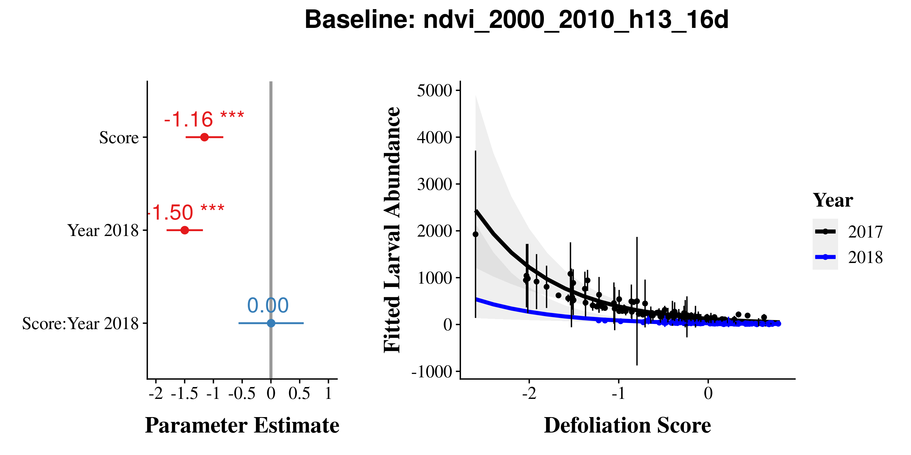

Defoliation Model Comparison
================
James Mickley and Audrey Barker Plotkin
July 22, 2020

  - [Overview](#overview)
      - [Summary of Results](#summary-of-results)
  - [Quabbin](#quabbin)
      - [Models](#models)
      - [AIC](#aic)
      - [R2](#r2)
      - [Plots from Top Baselines](#plots-from-top-baselines)
          - [Top Quabbin Baseline:
            tcg\_2005\_2015\_h13\_full](#top-quabbin-baseline-tcg_2005_2015_h13_full)
          - [Consensus Baseline:
            reanalysis](#consensus-baseline-reanalysis)
  - [CT Burlap Larva](#ct-burlap-larva)
      - [Models](#models-1)
      - [AIC](#aic-1)
          - [Both Years](#both-years)
          - [2017 Only](#only)
          - [2018 Only](#only-1)
      - [R2](#r2-1)
          - [2017 Only](#only-2)
          - [2018 Only](#only-3)
      - [Plots from Top Baselines
        (2017/2018)](#plots-from-top-baselines-20172018)
          - [Top Burlap Baseline:
            ndvi\_2000\_2010\_h13\_16d](#top-burlap-baseline-ndvi_2000_2010_h13_16d)
          - [Consensus Baseline:
            reanalysis](#consensus-baseline-reanalysis-1)
      - [Plots from Top Baselines (2017
        only)](#plots-from-top-baselines-2017-only)
          - [Top Burlap Baseline:
            sr\_2000\_2010\_h13\_16d](#top-burlap-baseline-sr_2000_2010_h13_16d)
          - [Consensus Baseline:](#consensus-baseline)
  - [Egg Mass Models](#egg-mass-models)
      - [AIC](#aic-2)
          - [Both Years](#both-years-1)
          - [2017 Only](#only-4)
          - [2018 Only](#only-5)
      - [R2](#r2-2)
          - [2017 Only](#only-6)
          - [2018 Only](#only-7)
      - [Plots from Top Baselines
        (2017/2018)](#plots-from-top-baselines-20172018-1)
          - [Top Egg Mass Baseline:
            sr\_2000-2010\_h13\_16d](#top-egg-mass-baseline-sr_2000-2010_h13_16d)
          - [Consensus Baseline:](#consensus-baseline-1)
      - [Plots from Top Baselines (2017
        only)](#plots-from-top-baselines-2017-only-1)
      - [Top Egg Mass Baseline:
        tcg\_2000\_2010\_h12\_full](#top-egg-mass-baseline-tcg_2000_2010_h12_full)
          - [Consensus Baseline:](#consensus-baseline-2)
  - [Egg Mass Predictor](#egg-mass-predictor)
      - [AIC](#aic-3)
      - [R2](#r2-3)
      - [Plots](#plots)
  - [Combined Panel Plots](#combined-panel-plots)
      - [Top](#top)
      - [Consensus](#consensus)
      - [Graphs](#graphs)

## Overview

This analysis compares Val Pasquarella’s defoliation data from Landsat
satellite to the following:

1 Defoliation data collected in late September 2017 from 483 points
within 6 ‘hotspots’ in the Quabbin Watershed Forest (Rich MacLean, DCR
Watershed Forester field data lead). 2 Lymantria larval and egg mass
abundance data collected in 2017 and 2018 from 12 trees each in 32
forest fragments of varying size in Eastern Connecticut.

Here, we examine how varying the following components of the Landsat
change-in-condition model affect how well that predicts defoliation or
Lymantria abundance on the ground:

  - Spectral index (TGC, NDVI, SR, EVI)
  - Baseline period (2000-2010, 2005-2015)
  - Harmonic periods (12- and -6 month, 12- and 4-month)
  - Data included (all available data which varies over time, consistent
    16d interval)

We evaluate the predictive ability of the following: \* Landsat
condition scores predicting the proportion of canopy defoliated \*
Landsat condition scores predicting larval Lymantria abundance \*
Landsat condition scores predicting Lymantria egg mass abundance \* Egg
mass abundance predicting larval Lymantria abundance

### Summary of Results

  - For both larval abundance and egg masses, the baseline
    sr\_2000\_2010\_h13\_16d is the best predictor
  - All of the best models are SR (top 6 models). NDVI does
  - Condition score can account for 58-67% of the variation in larval
    abundance and 6-32% of the variation in egg masses
  - By comparison, egg masses only predict 55% of the variation in
    larval abundance, and condition scores outperform it as a predictor.
  - Predictive ability of Landsat condition scores weakens in 2018, the
    non-outbreak year, but there is still a pattern.
  - Egg masses only predict larval abundance during the outbreak, no
    relationship in 2018

Forest Condition Assessment - Github

## Quabbin

### Models

### AIC

Here we compare all of the baselines using
[AIC](https://en.wikipedia.org/wiki/Akaike_information_criterion) model
selection.

Models are ranked according to how good they are at predicting canopy
defoliation.

The column to pay attention to is dAIC, or the difference in AIC between
models. A rule of thumb is that models with a dAIC less than 2 are not
notably different in their quality, and that models within 6 are
similar.

| model                          |      AIC |   dAIC | df | weight |
| :----------------------------- | -------: | -----: | -: | -----: |
| m\_tcg\_2005\_2015\_h13\_full  | \-687.86 |   0.00 |  4 |   0.95 |
| m\_reanalysis                  | \-681.69 |   6.17 |  4 |   0.04 |
| m\_evi\_2005\_2015\_h13\_full  | \-677.19 |  10.67 |  4 |   0.00 |
| m\_tcg\_2005\_2015\_h13\_16d   | \-653.95 |  33.90 |  4 |   0.00 |
| m\_tcg\_2005\_2015\_h12\_full  | \-651.38 |  36.48 |  4 |   0.00 |
| m\_tcg\_2000\_2010\_h13\_full  | \-647.89 |  39.96 |  4 |   0.00 |
| m\_sr\_2000\_2010\_h12\_16d    | \-645.60 |  42.26 |  4 |   0.00 |
| m\_sr\_2000\_2010\_h13\_16d    | \-644.92 |  42.93 |  4 |   0.00 |
| m\_tcg\_2000\_2010\_h13\_16d   | \-644.62 |  43.23 |  4 |   0.00 |
| m\_evi\_2005\_2015\_h13\_16d   | \-644.11 |  43.75 |  4 |   0.00 |
| m\_evi\_2005\_2015\_h12\_full  | \-643.58 |  44.27 |  4 |   0.00 |
| m\_evi\_2000\_2010\_h13\_full  | \-631.06 |  56.80 |  4 |   0.00 |
| m\_evi\_2000\_2010\_h13\_16d   | \-627.33 |  60.53 |  4 |   0.00 |
| m\_sr\_2000\_2010\_h13\_full   | \-626.61 |  61.25 |  4 |   0.00 |
| m\_sr\_2000\_2010\_h12\_full   | \-625.84 |  62.02 |  4 |   0.00 |
| m\_ndvi\_2005\_2015\_h13\_full | \-623.91 |  63.94 |  4 |   0.00 |
| m\_tcg\_2000\_2010\_h12\_full  | \-622.31 |  65.55 |  4 |   0.00 |
| m\_tcg\_2005\_2015\_h12\_16d   | \-617.21 |  70.65 |  4 |   0.00 |
| m\_tcg\_2000\_2010\_h12\_16d   | \-615.55 |  72.30 |  4 |   0.00 |
| m\_evi\_2005\_2015\_h12\_16d   | \-612.69 |  75.17 |  4 |   0.00 |
| m\_sr\_2005\_2015\_h13\_full   | \-609.01 |  78.85 |  4 |   0.00 |
| m\_sr\_2005\_2015\_h13\_16d    | \-607.97 |  79.88 |  4 |   0.00 |
| m\_sr\_2005\_2015\_h12\_16d    | \-604.16 |  83.69 |  4 |   0.00 |
| m\_evi\_2000\_2010\_h12\_full  | \-602.13 |  85.73 |  4 |   0.00 |
| m\_sr\_2005\_2015\_h12\_full   | \-601.03 |  86.83 |  4 |   0.00 |
| m\_evi\_2000\_2010\_h12\_16d   | \-598.74 |  89.12 |  4 |   0.00 |
| m\_ndvi\_2005\_2015\_h13\_16d  | \-593.56 |  94.30 |  4 |   0.00 |
| m\_ndvi\_2000\_2010\_h13\_16d  | \-585.95 | 101.91 |  4 |   0.00 |
| m\_ndvi\_2000\_2010\_h13\_full | \-585.14 | 102.72 |  4 |   0.00 |
| m\_ndvi\_2005\_2015\_h12\_full | \-584.38 | 103.48 |  4 |   0.00 |
| m\_ndvi\_2000\_2010\_h12\_16d  | \-574.99 | 112.87 |  4 |   0.00 |
| m\_ndvi\_2000\_2010\_h12\_full | \-573.68 | 114.18 |  4 |   0.00 |
| m\_ndvi\_2005\_2015\_h12\_16d  | \-556.78 | 131.08 |  4 |   0.00 |

### R2

Here, we are calculating the proportion of variance in the defoliation
that is explained by each model.

We actually get two R2 numbers for these models, a marginal
and a conditional R2 (using the method from [Nakagawa &
Schielzeth 2013](https://doi.org/10.1111/j.2041-210x.2012.00261.x)):

  - **conditional R2**: the proportion of variance explained
    by the whole model: defoliation score, and hotplot
  - **marginal R2**: the proportion of variance explained by
    just defoliation score (just fixed factors)

In our case, we’re mostly interested in the marginal R2. This
is going to tell us how well that particular defoliation score explains
the canopy defoliation.

| baseline                       | R2\_marginal | R2\_conditional |
| :----------------------------- | -----------: | --------------: |
| m\_tcg\_2005\_2015\_h13\_full  |         0.60 |            0.63 |
| m\_reanalysis                  |         0.59 |            0.64 |
| m\_evi\_2005\_2015\_h13\_full  |         0.57 |            0.61 |
| m\_tcg\_2005\_2015\_h13\_16d   |         0.55 |            0.58 |
| m\_tcg\_2000\_2010\_h13\_full  |         0.55 |            0.57 |
| m\_tcg\_2000\_2010\_h13\_16d   |         0.54 |            0.59 |
| m\_tcg\_2005\_2015\_h12\_full  |         0.53 |            0.57 |
| m\_evi\_2005\_2015\_h13\_16d   |         0.52 |            0.55 |
| m\_evi\_2000\_2010\_h13\_full  |         0.51 |            0.53 |
| m\_evi\_2005\_2015\_h12\_full  |         0.51 |            0.55 |
| m\_evi\_2000\_2010\_h13\_16d   |         0.49 |            0.55 |
| m\_sr\_2000\_2010\_h13\_16d    |         0.47 |            0.60 |
| m\_tcg\_2000\_2010\_h12\_full  |         0.47 |            0.52 |
| m\_sr\_2000\_2010\_h12\_16d    |         0.46 |            0.61 |
| m\_tcg\_2000\_2010\_h12\_16d   |         0.46 |            0.55 |
| m\_ndvi\_2005\_2015\_h13\_full |         0.46 |            0.48 |
| m\_tcg\_2005\_2015\_h12\_16d   |         0.45 |            0.52 |
| m\_sr\_2000\_2010\_h13\_full   |         0.44 |            0.56 |
| m\_evi\_2005\_2015\_h12\_16d   |         0.43 |            0.49 |
| m\_sr\_2000\_2010\_h12\_full   |         0.42 |            0.58 |
| m\_evi\_2000\_2010\_h12\_full  |         0.41 |            0.45 |
| m\_evi\_2000\_2010\_h12\_16d   |         0.40 |            0.50 |
| m\_sr\_2005\_2015\_h13\_full   |         0.40 |            0.46 |
| m\_sr\_2005\_2015\_h13\_16d    |         0.40 |            0.45 |
| m\_sr\_2005\_2015\_h12\_full   |         0.38 |            0.44 |
| m\_sr\_2005\_2015\_h12\_16d    |         0.37 |            0.45 |
| m\_ndvi\_2005\_2015\_h13\_16d  |         0.36 |            0.39 |
| m\_ndvi\_2005\_2015\_h12\_full |         0.33 |            0.37 |
| m\_ndvi\_2000\_2010\_h13\_16d  |         0.30 |            0.42 |
| m\_ndvi\_2000\_2010\_h13\_full |         0.29 |            0.42 |
| m\_ndvi\_2000\_2010\_h12\_16d  |         0.25 |            0.41 |
| m\_ndvi\_2000\_2010\_h12\_full |         0.24 |            0.42 |
| m\_ndvi\_2005\_2015\_h12\_16d  |         0.18 |            0.26 |

### Plots from Top Baselines

#### Top Quabbin Baseline: tcg\_2005\_2015\_h13\_full

<!-- -->

#### Consensus Baseline: reanalysis

<!-- -->

## CT Burlap Larva

### Models

### AIC

Here we compare all of the baselines using
[AIC](https://en.wikipedia.org/wiki/Akaike_information_criterion) model
selection.

Models are ranked according to how good they are at predicting Lymantria
abundance from burlap traps.

The column to pay attention to is dAIC, or the difference in AIC between
models. A rule of thumb is that models with a dAIC less than 2 are not
notably different in their quality, and that models within 6 are
similar.

#### Both Years

| model                          |     AIC |  dAIC | df | weight |
| :----------------------------- | ------: | ----: | -: | -----: |
| m\_ndvi\_2000\_2010\_h13\_16d  | 2097.77 |  0.00 |  7 |   0.80 |
| m\_ndvi\_2000\_2010\_h13\_full | 2102.60 |  4.83 |  7 |   0.07 |
| m\_sr\_2000\_2010\_h13\_16d    | 2102.96 |  5.19 |  7 |   0.06 |
| m\_sr\_2000\_2010\_h13\_full   | 2105.31 |  7.54 |  7 |   0.02 |
| m\_evi\_2000\_2010\_h13\_full  | 2107.22 |  9.45 |  7 |   0.01 |
| m\_sr\_2000\_2010\_h12\_16d    | 2107.25 |  9.48 |  7 |   0.01 |
| m\_sr\_2005\_2015\_h13\_16d    | 2107.65 |  9.88 |  7 |   0.01 |
| m\_tcg\_2000\_2010\_h13\_full  | 2107.89 | 10.12 |  7 |   0.01 |
| m\_tcg\_2000\_2010\_h13\_16d   | 2108.08 | 10.31 |  7 |   0.00 |
| m\_evi\_2000\_2010\_h13\_16d   | 2108.32 | 10.55 |  7 |   0.00 |
| m\_sr\_2000\_2010\_h12\_full   | 2109.32 | 11.55 |  7 |   0.00 |
| m\_sr\_2005\_2015\_h12\_16d    | 2110.05 | 12.28 |  7 |   0.00 |
| m\_tcg\_2000\_2010\_h12\_16d   | 2112.11 | 14.34 |  7 |   0.00 |
| m\_tcg\_2005\_2015\_h13\_16d   | 2112.16 | 14.39 |  7 |   0.00 |
| m\_ndvi\_2005\_2015\_h13\_16d  | 2112.34 | 14.57 |  7 |   0.00 |
| m\_tcg\_2000\_2010\_h12\_full  | 2112.38 | 14.61 |  7 |   0.00 |
| m\_tcg\_2005\_2015\_h12\_full  | 2112.40 | 14.63 |  7 |   0.00 |
| m\_ndvi\_2005\_2015\_h13\_full | 2112.70 | 14.93 |  7 |   0.00 |
| m\_evi\_2000\_2010\_h12\_full  | 2112.90 | 15.13 |  7 |   0.00 |
| m\_tcg\_2005\_2015\_h13\_full  | 2112.93 | 15.16 |  7 |   0.00 |
| m\_sr\_2005\_2015\_h13\_full   | 2112.98 | 15.21 |  7 |   0.00 |
| m\_evi\_2000\_2010\_h12\_16d   | 2113.12 | 15.35 |  7 |   0.00 |
| m\_evi\_2005\_2015\_h13\_full  | 2113.20 | 15.43 |  7 |   0.00 |
| m\_evi\_2005\_2015\_h13\_16d   | 2113.28 | 15.51 |  7 |   0.00 |
| m\_reanalysis                  | 2113.65 | 15.88 |  7 |   0.00 |
| m\_sr\_2005\_2015\_h12\_full   | 2113.92 | 16.15 |  7 |   0.00 |
| m\_ndvi\_2000\_2010\_h12\_16d  | 2113.97 | 16.20 |  7 |   0.00 |
| m\_tcg\_2005\_2015\_h12\_16d   | 2114.54 | 16.77 |  7 |   0.00 |
| m\_evi\_2005\_2015\_h12\_full  | 2114.59 | 16.82 |  7 |   0.00 |
| m\_evi\_2005\_2015\_h12\_16d   | 2116.99 | 19.22 |  7 |   0.00 |
| m\_ndvi\_2000\_2010\_h12\_full | 2117.62 | 19.85 |  7 |   0.00 |
| m\_ndvi\_2005\_2015\_h12\_full | 2124.26 | 26.49 |  7 |   0.00 |
| m\_ndvi\_2005\_2015\_h12\_16d  | 2125.18 | 27.41 |  7 |   0.00 |

#### 2017 Only

| model                          |     AIC |  dAIC | df | weight |
| :----------------------------- | ------: | ----: | -: | -----: |
| m\_sr\_2000\_2010\_h13\_16d    | 1239.92 |  0.00 |  5 |   0.15 |
| m\_sr\_2000\_2010\_h13\_full   | 1240.84 |  0.92 |  5 |   0.10 |
| m\_sr\_2000\_2010\_h12\_16d    | 1241.35 |  1.43 |  5 |   0.07 |
| m\_tcg\_2000\_2010\_h13\_full  | 1241.96 |  2.05 |  5 |   0.06 |
| m\_evi\_2000\_2010\_h13\_full  | 1242.02 |  2.10 |  5 |   0.05 |
| m\_sr\_2005\_2015\_h13\_16d    | 1242.06 |  2.15 |  5 |   0.05 |
| m\_tcg\_2000\_2010\_h12\_16d   | 1242.07 |  2.15 |  5 |   0.05 |
| m\_tcg\_2000\_2010\_h13\_16d   | 1242.11 |  2.19 |  5 |   0.05 |
| m\_tcg\_2005\_2015\_h12\_full  | 1242.28 |  2.36 |  5 |   0.05 |
| m\_sr\_2005\_2015\_h12\_16d    | 1242.36 |  2.45 |  5 |   0.05 |
| m\_evi\_2000\_2010\_h13\_16d   | 1242.58 |  2.66 |  5 |   0.04 |
| m\_evi\_2000\_2010\_h12\_16d   | 1242.58 |  2.67 |  5 |   0.04 |
| m\_sr\_2000\_2010\_h12\_full   | 1242.84 |  2.92 |  5 |   0.04 |
| m\_ndvi\_2000\_2010\_h13\_16d  | 1242.92 |  3.00 |  5 |   0.03 |
| m\_sr\_2005\_2015\_h12\_full   | 1243.51 |  3.59 |  5 |   0.03 |
| m\_tcg\_2000\_2010\_h12\_full  | 1243.75 |  3.83 |  5 |   0.02 |
| m\_tcg\_2005\_2015\_h12\_16d   | 1244.05 |  4.13 |  5 |   0.02 |
| m\_evi\_2005\_2015\_h12\_full  | 1244.16 |  4.24 |  5 |   0.02 |
| m\_evi\_2000\_2010\_h12\_full  | 1244.34 |  4.43 |  5 |   0.02 |
| m\_sr\_2005\_2015\_h13\_full   | 1245.02 |  5.11 |  5 |   0.01 |
| m\_ndvi\_2000\_2010\_h12\_16d  | 1245.51 |  5.59 |  5 |   0.01 |
| m\_tcg\_2005\_2015\_h13\_16d   | 1245.69 |  5.77 |  5 |   0.01 |
| m\_ndvi\_2000\_2010\_h13\_full | 1246.07 |  6.15 |  5 |   0.01 |
| m\_tcg\_2005\_2015\_h13\_full  | 1246.16 |  6.24 |  5 |   0.01 |
| m\_evi\_2005\_2015\_h12\_16d   | 1246.43 |  6.51 |  5 |   0.01 |
| m\_reanalysis                  | 1246.61 |  6.69 |  5 |   0.01 |
| m\_evi\_2005\_2015\_h13\_full  | 1246.99 |  7.08 |  5 |   0.00 |
| m\_evi\_2005\_2015\_h13\_16d   | 1247.57 |  7.66 |  5 |   0.00 |
| m\_ndvi\_2005\_2015\_h13\_16d  | 1250.06 | 10.14 |  5 |   0.00 |
| m\_ndvi\_2000\_2010\_h12\_full | 1250.92 | 11.01 |  5 |   0.00 |
| m\_ndvi\_2005\_2015\_h13\_full | 1251.07 | 11.16 |  5 |   0.00 |
| m\_ndvi\_2005\_2015\_h12\_full | 1253.60 | 13.69 |  5 |   0.00 |
| m\_ndvi\_2005\_2015\_h12\_16d  | 1254.74 | 14.82 |  5 |   0.00 |

#### 2018 Only

| model                          |    AIC | dAIC | df | weight |
| :----------------------------- | -----: | ---: | -: | -----: |
| m\_ndvi\_2000\_2010\_h13\_16d  | 822.29 | 0.00 |  5 |   0.37 |
| m\_ndvi\_2000\_2010\_h13\_full | 824.85 | 2.57 |  5 |   0.10 |
| m\_ndvi\_2000\_2010\_h12\_16d  | 826.52 | 4.23 |  5 |   0.04 |
| m\_ndvi\_2000\_2010\_h12\_full | 826.86 | 4.57 |  5 |   0.04 |
| m\_sr\_2000\_2010\_h13\_16d    | 827.45 | 5.16 |  5 |   0.03 |
| m\_evi\_2000\_2010\_h13\_16d   | 827.57 | 5.28 |  5 |   0.03 |
| m\_evi\_2005\_2015\_h13\_16d   | 827.61 | 5.32 |  5 |   0.03 |
| m\_sr\_2000\_2010\_h12\_16d    | 827.76 | 5.47 |  5 |   0.02 |
| m\_tcg\_2005\_2015\_h13\_16d   | 827.86 | 5.57 |  5 |   0.02 |
| m\_evi\_2000\_2010\_h13\_full  | 828.04 | 5.75 |  5 |   0.02 |
| m\_tcg\_2000\_2010\_h13\_16d   | 828.15 | 5.86 |  5 |   0.02 |
| m\_evi\_2000\_2010\_h12\_full  | 828.15 | 5.87 |  5 |   0.02 |
| m\_evi\_2000\_2010\_h12\_16d   | 828.25 | 5.96 |  5 |   0.02 |
| m\_sr\_2000\_2010\_h13\_full   | 828.57 | 6.28 |  5 |   0.02 |
| m\_sr\_2000\_2010\_h12\_full   | 828.64 | 6.35 |  5 |   0.02 |
| m\_tcg\_2000\_2010\_h12\_16d   | 828.73 | 6.45 |  5 |   0.01 |
| m\_ndvi\_2005\_2015\_h12\_full | 828.74 | 6.45 |  5 |   0.01 |
| m\_tcg\_2000\_2010\_h13\_full  | 828.78 | 6.49 |  5 |   0.01 |
| m\_tcg\_2000\_2010\_h12\_full  | 828.88 | 6.59 |  5 |   0.01 |
| m\_sr\_2005\_2015\_h13\_16d    | 828.99 | 6.70 |  5 |   0.01 |
| m\_evi\_2005\_2015\_h12\_16d   | 828.99 | 6.70 |  5 |   0.01 |
| m\_tcg\_2005\_2015\_h12\_16d   | 829.13 | 6.85 |  5 |   0.01 |
| m\_ndvi\_2005\_2015\_h12\_16d  | 829.16 | 6.88 |  5 |   0.01 |
| m\_ndvi\_2005\_2015\_h13\_16d  | 829.21 | 6.92 |  5 |   0.01 |
| m\_evi\_2005\_2015\_h13\_full  | 829.27 | 6.98 |  5 |   0.01 |
| m\_sr\_2005\_2015\_h12\_16d    | 829.33 | 7.04 |  5 |   0.01 |
| m\_tcg\_2005\_2015\_h13\_full  | 829.39 | 7.10 |  5 |   0.01 |
| m\_ndvi\_2005\_2015\_h13\_full | 829.58 | 7.29 |  5 |   0.01 |
| m\_reanalysis                  | 829.58 | 7.29 |  5 |   0.01 |
| m\_sr\_2005\_2015\_h13\_full   | 829.66 | 7.37 |  5 |   0.01 |
| m\_evi\_2005\_2015\_h12\_full  | 829.68 | 7.39 |  5 |   0.01 |
| m\_sr\_2005\_2015\_h12\_full   | 829.68 | 7.39 |  5 |   0.01 |
| m\_tcg\_2005\_2015\_h12\_full  | 829.68 | 7.39 |  5 |   0.01 |

### R2

Here, we are calculating the proportion of variance in the Lymantria
abundance data that is explained by each model.

We actually get two R2 numbers for these models, a marginal
and a conditional R2 (using the method from [Nakagawa &
Schielzeth 2013](https://doi.org/10.1111/j.2041-210x.2012.00261.x)):

  - **conditional R2**: the proportion of variance explained
    by the whole model: year, defoliation score, block, and site
  - **marginal R2**: the proportion of variance explained by
    just year and defoliation score (just fixed factors)

In our case, we’re mostly interested in the marginal R2. This
is going to tell us how well that particular defoliation score explains
the abundance of Lymantria.

| baseline                       | R2\_marginal | R2\_conditional |
| :----------------------------- | -----------: | --------------: |
| m\_ndvi\_2000\_2010\_h13\_16d  |         0.69 |            0.78 |
| m\_ndvi\_2000\_2010\_h13\_full |         0.69 |            0.76 |
| m\_evi\_2000\_2010\_h13\_16d   |         0.68 |            0.75 |
| m\_tcg\_2000\_2010\_h13\_16d   |         0.68 |            0.75 |
| m\_sr\_2000\_2010\_h13\_16d    |         0.67 |            0.77 |
| m\_sr\_2000\_2010\_h13\_full   |         0.67 |            0.76 |
| m\_tcg\_2000\_2010\_h13\_full  |         0.67 |            0.75 |
| m\_evi\_2000\_2010\_h13\_full  |         0.67 |            0.75 |
| m\_sr\_2000\_2010\_h12\_full   |         0.66 |            0.75 |
| m\_tcg\_2000\_2010\_h12\_full  |         0.66 |            0.74 |
| m\_evi\_2000\_2010\_h12\_16d   |         0.66 |            0.73 |
| m\_tcg\_2000\_2010\_h12\_16d   |         0.66 |            0.74 |
| m\_sr\_2005\_2015\_h13\_16d    |         0.66 |            0.77 |
| m\_evi\_2000\_2010\_h12\_full  |         0.66 |            0.74 |
| m\_sr\_2000\_2010\_h12\_16d    |         0.66 |            0.76 |
| m\_tcg\_2005\_2015\_h12\_full  |         0.66 |            0.75 |
| m\_ndvi\_2005\_2015\_h13\_16d  |         0.66 |            0.76 |
| m\_ndvi\_2000\_2010\_h12\_full |         0.66 |            0.74 |
| m\_sr\_2005\_2015\_h12\_16d    |         0.65 |            0.77 |
| m\_tcg\_2005\_2015\_h13\_full  |         0.65 |            0.75 |
| m\_sr\_2005\_2015\_h13\_full   |         0.65 |            0.76 |
| m\_ndvi\_2005\_2015\_h13\_full |         0.65 |            0.76 |
| m\_sr\_2005\_2015\_h12\_full   |         0.65 |            0.76 |
| m\_evi\_2005\_2015\_h13\_full  |         0.65 |            0.75 |
| m\_evi\_2005\_2015\_h12\_full  |         0.65 |            0.74 |
| m\_tcg\_2005\_2015\_h13\_16d   |         0.65 |            0.76 |
| m\_ndvi\_2000\_2010\_h12\_16d  |         0.65 |            0.75 |
| m\_reanalysis                  |         0.65 |            0.76 |
| m\_tcg\_2005\_2015\_h12\_16d   |         0.65 |            0.76 |
| m\_evi\_2005\_2015\_h13\_16d   |         0.64 |            0.76 |
| m\_evi\_2005\_2015\_h12\_16d   |         0.63 |            0.75 |
| m\_ndvi\_2005\_2015\_h12\_full |         0.63 |            0.73 |
| m\_ndvi\_2005\_2015\_h12\_16d  |         0.62 |            0.74 |

#### 2017 Only

| baseline                       | R2\_marginal | R2\_conditional |
| :----------------------------- | -----------: | --------------: |
| m\_sr\_2000\_2010\_h13\_16d    |         0.45 |            0.73 |
| m\_sr\_2000\_2010\_h13\_full   |         0.44 |            0.73 |
| m\_tcg\_2000\_2010\_h13\_16d   |         0.44 |            0.69 |
| m\_tcg\_2000\_2010\_h13\_full  |         0.44 |            0.68 |
| m\_ndvi\_2000\_2010\_h13\_16d  |         0.43 |            0.71 |
| m\_sr\_2005\_2015\_h12\_16d    |         0.43 |            0.74 |
| m\_evi\_2000\_2010\_h13\_16d   |         0.43 |            0.69 |
| m\_evi\_2000\_2010\_h13\_full  |         0.43 |            0.68 |
| m\_sr\_2005\_2015\_h13\_16d    |         0.43 |            0.74 |
| m\_sr\_2000\_2010\_h12\_16d    |         0.43 |            0.73 |
| m\_sr\_2000\_2010\_h12\_full   |         0.42 |            0.72 |
| m\_tcg\_2005\_2015\_h12\_full  |         0.42 |            0.71 |
| m\_sr\_2005\_2015\_h12\_full   |         0.42 |            0.74 |
| m\_tcg\_2000\_2010\_h12\_16d   |         0.42 |            0.70 |
| m\_evi\_2000\_2010\_h12\_16d   |         0.42 |            0.70 |
| m\_tcg\_2000\_2010\_h12\_full  |         0.41 |            0.68 |
| m\_evi\_2000\_2010\_h12\_full  |         0.40 |            0.68 |
| m\_evi\_2005\_2015\_h12\_full  |         0.40 |            0.70 |
| m\_sr\_2005\_2015\_h13\_full   |         0.39 |            0.72 |
| m\_ndvi\_2000\_2010\_h12\_16d  |         0.39 |            0.73 |
| m\_ndvi\_2000\_2010\_h13\_full |         0.39 |            0.70 |
| m\_tcg\_2005\_2015\_h12\_16d   |         0.39 |            0.73 |
| m\_tcg\_2005\_2015\_h13\_full  |         0.37 |            0.70 |
| m\_tcg\_2005\_2015\_h13\_16d   |         0.36 |            0.72 |
| m\_evi\_2005\_2015\_h13\_full  |         0.36 |            0.69 |
| m\_evi\_2005\_2015\_h12\_16d   |         0.36 |            0.72 |
| m\_ndvi\_2005\_2015\_h13\_16d  |         0.35 |            0.69 |
| m\_ndvi\_2000\_2010\_h12\_full |         0.35 |            0.70 |
| m\_evi\_2005\_2015\_h13\_16d   |         0.34 |            0.71 |
| m\_reanalysis                  |         0.34 |            0.70 |
| m\_ndvi\_2005\_2015\_h13\_full |         0.32 |            0.68 |
| m\_ndvi\_2005\_2015\_h12\_full |         0.32 |            0.68 |
| m\_ndvi\_2005\_2015\_h12\_16d  |         0.31 |            0.69 |

#### 2018 Only

Condition score is only a significant predictor of larval abundance for
the two ndvi\_2000-2010\_h13 baselines.

| baseline                       | R2\_marginal | R2\_conditional |
| :----------------------------- | -----------: | --------------: |
| m\_ndvi\_2000\_2010\_h13\_16d  |         0.07 |            0.79 |
| m\_ndvi\_2000\_2010\_h13\_full |         0.04 |            0.80 |
| m\_ndvi\_2000\_2010\_h12\_full |         0.02 |            0.81 |
| m\_ndvi\_2000\_2010\_h12\_16d  |         0.02 |            0.81 |
| m\_evi\_2005\_2015\_h13\_16d   |         0.02 |            0.81 |
| m\_tcg\_2005\_2015\_h13\_16d   |         0.02 |            0.80 |
| m\_sr\_2000\_2010\_h13\_16d    |         0.02 |            0.80 |
| m\_evi\_2000\_2010\_h13\_16d   |         0.02 |            0.80 |
| m\_sr\_2000\_2010\_h12\_16d    |         0.01 |            0.80 |
| m\_evi\_2000\_2010\_h13\_full  |         0.01 |            0.81 |
| m\_tcg\_2000\_2010\_h13\_16d   |         0.01 |            0.80 |
| m\_evi\_2000\_2010\_h12\_full  |         0.01 |            0.81 |
| m\_sr\_2000\_2010\_h13\_full   |         0.01 |            0.80 |
| m\_evi\_2000\_2010\_h12\_16d   |         0.01 |            0.81 |
| m\_sr\_2000\_2010\_h12\_full   |         0.01 |            0.80 |
| m\_ndvi\_2005\_2015\_h12\_full |         0.01 |            0.82 |
| m\_sr\_2005\_2015\_h13\_16d    |         0.01 |            0.80 |
| m\_tcg\_2000\_2010\_h13\_full  |         0.01 |            0.80 |
| m\_evi\_2005\_2015\_h12\_16d   |         0.01 |            0.81 |
| m\_tcg\_2000\_2010\_h12\_16d   |         0.01 |            0.80 |
| m\_tcg\_2005\_2015\_h12\_16d   |         0.01 |            0.80 |
| m\_tcg\_2000\_2010\_h12\_full  |         0.01 |            0.81 |
| m\_ndvi\_2005\_2015\_h12\_16d  |         0.00 |            0.81 |
| m\_ndvi\_2005\_2015\_h13\_16d  |         0.00 |            0.79 |
| m\_evi\_2005\_2015\_h13\_full  |         0.00 |            0.80 |
| m\_sr\_2005\_2015\_h12\_16d    |         0.00 |            0.80 |
| m\_tcg\_2005\_2015\_h13\_full  |         0.00 |            0.80 |
| m\_ndvi\_2005\_2015\_h13\_full |         0.00 |            0.80 |
| m\_reanalysis                  |         0.00 |            0.80 |
| m\_sr\_2005\_2015\_h13\_full   |         0.00 |            0.80 |
| m\_evi\_2005\_2015\_h12\_full  |         0.00 |            0.80 |
| m\_sr\_2005\_2015\_h12\_full   |         0.00 |            0.80 |
| m\_tcg\_2005\_2015\_h12\_full  |         0.00 |            0.80 |

### Plots from Top Baselines (2017/2018)

#### Top Burlap Baseline: ndvi\_2000\_2010\_h13\_16d

<!-- -->

#### Consensus Baseline: reanalysis

<!-- -->

### Plots from Top Baselines (2017 only)

#### Top Burlap Baseline: sr\_2000\_2010\_h13\_16d

<!-- -->

#### Consensus Baseline:

## Egg Mass Models

### AIC

Here we compare all of the baselines using
[AIC](https://en.wikipedia.org/wiki/Akaike_information_criterion) model
selection.

Models are ranked according to how good they are at predicting Lymantria
egg mass counts.

The column to pay attention to is dAIC, or the difference in AIC between
models. A rule of thumb is that models with a dAIC less than 2 are not
notably different in their quality, and that models within 6 are
similar.

#### Both Years

| model                          |     AIC |  dAIC | df | weight |
| :----------------------------- | ------: | ----: | -: | -----: |
| m\_reanalysis                  | 1045.95 |  0.00 |  7 |   0.30 |
| m\_tcg\_2005\_2015\_h13\_16d   | 1047.48 |  1.53 |  7 |   0.14 |
| m\_tcg\_2005\_2015\_h12\_16d   | 1048.48 |  2.52 |  7 |   0.08 |
| m\_tcg\_2000\_2010\_h12\_full  | 1048.58 |  2.63 |  7 |   0.08 |
| m\_sr\_2000\_2010\_h12\_16d    | 1048.85 |  2.90 |  7 |   0.07 |
| m\_tcg\_2000\_2010\_h12\_16d   | 1049.41 |  3.46 |  7 |   0.05 |
| m\_sr\_2000\_2010\_h13\_16d    | 1049.60 |  3.64 |  7 |   0.05 |
| m\_tcg\_2000\_2010\_h13\_16d   | 1050.13 |  4.17 |  7 |   0.04 |
| m\_evi\_2005\_2015\_h13\_16d   | 1050.13 |  4.17 |  7 |   0.04 |
| m\_tcg\_2000\_2010\_h13\_full  | 1050.46 |  4.51 |  7 |   0.03 |
| m\_sr\_2005\_2015\_h13\_16d    | 1051.75 |  5.79 |  7 |   0.02 |
| m\_evi\_2000\_2010\_h13\_16d   | 1051.86 |  5.91 |  7 |   0.02 |
| m\_evi\_2005\_2015\_h12\_16d   | 1052.01 |  6.05 |  7 |   0.01 |
| m\_evi\_2000\_2010\_h12\_16d   | 1052.13 |  6.17 |  7 |   0.01 |
| m\_evi\_2000\_2010\_h12\_full  | 1052.55 |  6.59 |  7 |   0.01 |
| m\_tcg\_2005\_2015\_h12\_full  | 1052.81 |  6.86 |  7 |   0.01 |
| m\_evi\_2000\_2010\_h13\_full  | 1052.95 |  7.00 |  7 |   0.01 |
| m\_tcg\_2005\_2015\_h13\_full  | 1053.07 |  7.12 |  7 |   0.01 |
| m\_sr\_2000\_2010\_h12\_full   | 1053.37 |  7.42 |  7 |   0.01 |
| m\_sr\_2005\_2015\_h13\_full   | 1053.96 |  8.01 |  7 |   0.01 |
| m\_sr\_2000\_2010\_h13\_full   | 1054.41 |  8.46 |  7 |   0.00 |
| m\_ndvi\_2000\_2010\_h13\_16d  | 1054.92 |  8.97 |  7 |   0.00 |
| m\_sr\_2005\_2015\_h12\_full   | 1055.00 |  9.04 |  7 |   0.00 |
| m\_evi\_2005\_2015\_h13\_full  | 1055.40 |  9.45 |  7 |   0.00 |
| m\_sr\_2005\_2015\_h12\_16d    | 1055.44 |  9.48 |  7 |   0.00 |
| m\_evi\_2005\_2015\_h12\_full  | 1056.48 | 10.52 |  7 |   0.00 |
| m\_ndvi\_2000\_2010\_h12\_16d  | 1058.34 | 12.39 |  7 |   0.00 |
| m\_ndvi\_2005\_2015\_h13\_16d  | 1058.49 | 12.54 |  7 |   0.00 |
| m\_ndvi\_2005\_2015\_h13\_full | 1059.88 | 13.93 |  7 |   0.00 |
| m\_ndvi\_2000\_2010\_h13\_full | 1060.49 | 14.53 |  7 |   0.00 |
| m\_ndvi\_2000\_2010\_h12\_full | 1062.51 | 16.56 |  7 |   0.00 |
| m\_ndvi\_2005\_2015\_h12\_full | 1065.71 | 19.76 |  7 |   0.00 |
| m\_ndvi\_2005\_2015\_h12\_16d  | 1066.11 | 20.15 |  7 |   0.00 |

#### 2017 Only

| model                          |    AIC |  dAIC | df | weight |
| :----------------------------- | -----: | ----: | -: | -----: |
| m\_tcg\_2000\_2010\_h12\_full  | 542.95 |  0.00 |  5 |   0.25 |
| m\_reanalysis                  | 543.55 |  0.60 |  5 |   0.19 |
| m\_tcg\_2000\_2010\_h13\_full  | 544.02 |  1.07 |  5 |   0.15 |
| m\_tcg\_2000\_2010\_h12\_16d   | 545.61 |  2.66 |  5 |   0.07 |
| m\_evi\_2000\_2010\_h12\_full  | 546.23 |  3.28 |  5 |   0.05 |
| m\_evi\_2000\_2010\_h13\_full  | 546.32 |  3.37 |  5 |   0.05 |
| m\_sr\_2005\_2015\_h13\_16d    | 546.74 |  3.79 |  5 |   0.04 |
| m\_sr\_2000\_2010\_h12\_16d    | 546.84 |  3.89 |  5 |   0.04 |
| m\_tcg\_2000\_2010\_h13\_16d   | 546.87 |  3.92 |  5 |   0.04 |
| m\_evi\_2000\_2010\_h12\_16d   | 547.39 |  4.44 |  5 |   0.03 |
| m\_sr\_2000\_2010\_h13\_16d    | 548.14 |  5.19 |  5 |   0.02 |
| m\_evi\_2000\_2010\_h13\_16d   | 548.42 |  5.46 |  5 |   0.02 |
| m\_tcg\_2005\_2015\_h13\_16d   | 548.69 |  5.74 |  5 |   0.01 |
| m\_evi\_2005\_2015\_h13\_16d   | 549.96 |  7.00 |  5 |   0.01 |
| m\_sr\_2005\_2015\_h13\_full   | 550.13 |  7.18 |  5 |   0.01 |
| m\_sr\_2005\_2015\_h12\_16d    | 550.43 |  7.48 |  5 |   0.01 |
| m\_tcg\_2005\_2015\_h13\_full  | 550.51 |  7.56 |  5 |   0.01 |
| m\_tcg\_2005\_2015\_h12\_full  | 550.64 |  7.69 |  5 |   0.01 |
| m\_sr\_2005\_2015\_h12\_full   | 550.98 |  8.03 |  5 |   0.00 |
| m\_ndvi\_2000\_2010\_h13\_16d  | 551.27 |  8.32 |  5 |   0.00 |
| m\_tcg\_2005\_2015\_h12\_16d   | 551.42 |  8.47 |  5 |   0.00 |
| m\_evi\_2005\_2015\_h13\_full  | 551.60 |  8.64 |  5 |   0.00 |
| m\_sr\_2000\_2010\_h13\_full   | 551.64 |  8.68 |  5 |   0.00 |
| m\_sr\_2000\_2010\_h12\_full   | 551.71 |  8.76 |  5 |   0.00 |
| m\_ndvi\_2000\_2010\_h12\_16d  | 552.05 |  9.10 |  5 |   0.00 |
| m\_ndvi\_2005\_2015\_h13\_16d  | 553.07 | 10.12 |  5 |   0.00 |
| m\_evi\_2005\_2015\_h12\_full  | 553.14 | 10.19 |  5 |   0.00 |
| m\_evi\_2005\_2015\_h12\_16d   | 553.55 | 10.60 |  5 |   0.00 |
| m\_ndvi\_2000\_2010\_h13\_full | 555.23 | 12.27 |  5 |   0.00 |
| m\_ndvi\_2005\_2015\_h13\_full | 556.17 | 13.22 |  5 |   0.00 |
| m\_ndvi\_2000\_2010\_h12\_full | 557.51 | 14.56 |  5 |   0.00 |
| m\_ndvi\_2005\_2015\_h12\_full | 561.32 | 18.37 |  5 |   0.00 |
| m\_ndvi\_2005\_2015\_h12\_16d  | 561.96 | 19.01 |  5 |   0.00 |

#### 2018 Only

| model                          |    AIC |  dAIC | df | weight |
| :----------------------------- | -----: | ----: | -: | -----: |
| m\_tcg\_2005\_2015\_h13\_16d   | 516.62 |  0.00 |  5 |   0.27 |
| m\_evi\_2005\_2015\_h13\_16d   | 517.12 |  0.50 |  5 |   0.21 |
| m\_sr\_2000\_2010\_h12\_16d    | 518.66 |  2.04 |  5 |   0.10 |
| m\_sr\_2000\_2010\_h13\_16d    | 519.24 |  2.62 |  5 |   0.07 |
| m\_tcg\_2005\_2015\_h12\_16d   | 519.63 |  3.01 |  5 |   0.06 |
| m\_sr\_2005\_2015\_h13\_16d    | 520.52 |  3.90 |  5 |   0.04 |
| m\_evi\_2005\_2015\_h12\_16d   | 520.53 |  3.92 |  5 |   0.04 |
| m\_tcg\_2005\_2015\_h13\_full  | 521.59 |  4.98 |  5 |   0.02 |
| m\_reanalysis                  | 521.73 |  5.12 |  5 |   0.02 |
| m\_tcg\_2000\_2010\_h13\_16d   | 522.56 |  5.94 |  5 |   0.01 |
| m\_tcg\_2000\_2010\_h12\_full  | 522.67 |  6.06 |  5 |   0.01 |
| m\_ndvi\_2000\_2010\_h13\_16d  | 522.68 |  6.06 |  5 |   0.01 |
| m\_tcg\_2000\_2010\_h12\_16d   | 522.80 |  6.18 |  5 |   0.01 |
| m\_evi\_2005\_2015\_h13\_full  | 522.96 |  6.34 |  5 |   0.01 |
| m\_tcg\_2005\_2015\_h12\_full  | 522.99 |  6.37 |  5 |   0.01 |
| m\_sr\_2005\_2015\_h12\_16d    | 523.05 |  6.43 |  5 |   0.01 |
| m\_sr\_2000\_2010\_h12\_full   | 523.19 |  6.57 |  5 |   0.01 |
| m\_evi\_2000\_2010\_h13\_16d   | 523.21 |  6.59 |  5 |   0.01 |
| m\_sr\_2005\_2015\_h13\_full   | 523.25 |  6.64 |  5 |   0.01 |
| m\_tcg\_2000\_2010\_h13\_full  | 523.38 |  6.76 |  5 |   0.01 |
| m\_ndvi\_2000\_2010\_h12\_16d  | 523.54 |  6.92 |  5 |   0.01 |
| m\_sr\_2000\_2010\_h13\_full   | 523.69 |  7.07 |  5 |   0.01 |
| m\_evi\_2000\_2010\_h12\_16d   | 523.91 |  7.29 |  5 |   0.01 |
| m\_sr\_2005\_2015\_h12\_full   | 524.16 |  7.54 |  5 |   0.01 |
| m\_evi\_2000\_2010\_h12\_full  | 524.44 |  7.82 |  5 |   0.01 |
| m\_evi\_2005\_2015\_h12\_full  | 524.54 |  7.92 |  5 |   0.01 |
| m\_evi\_2000\_2010\_h13\_full  | 524.83 |  8.21 |  5 |   0.00 |
| m\_ndvi\_2005\_2015\_h13\_16d  | 527.07 | 10.46 |  5 |   0.00 |
| m\_ndvi\_2000\_2010\_h12\_full | 527.31 | 10.69 |  5 |   0.00 |
| m\_ndvi\_2000\_2010\_h13\_full | 527.68 | 11.06 |  5 |   0.00 |
| m\_ndvi\_2005\_2015\_h13\_full | 528.32 | 11.71 |  5 |   0.00 |
| m\_ndvi\_2005\_2015\_h12\_16d  | 529.87 | 13.26 |  5 |   0.00 |
| m\_ndvi\_2005\_2015\_h12\_full | 530.02 | 13.40 |  5 |   0.00 |

### R2

Here, we are calculating the proportion of variance in the Lymantria egg
mass count data that is explained by each model.

We actually get two R2 numbers for these models, a marginal
and a conditional R2 (using the method from [Nakagawa &
Schielzeth 2013](https://doi.org/10.1111/j.2041-210x.2012.00261.x)):

  - **conditional R2**: the proportion of variance explained
    by the whole model: year, defoliation score, block, and site
  - **marginal R2**: the proportion of variance explained by
    just year and defoliation score (just fixed factors)

In our case, we’re mostly interested in the marginal R2. This
is going to tell us how well that particular defoliation score explains
the number of Lymantria egg masses.

| baseline                       | R2\_marginal | R2\_conditional |
| :----------------------------- | -----------: | --------------: |
| m\_sr\_2000\_2010\_h12\_16d    |         0.21 |            0.79 |
| m\_sr\_2000\_2010\_h13\_16d    |         0.20 |            0.79 |
| m\_tcg\_2005\_2015\_h12\_16d   |         0.20 |            0.81 |
| m\_tcg\_2005\_2015\_h13\_16d   |         0.20 |            0.81 |
| m\_sr\_2005\_2015\_h13\_16d    |         0.19 |            0.79 |
| m\_reanalysis                  |         0.19 |            0.81 |
| m\_sr\_2005\_2015\_h13\_full   |         0.19 |            0.78 |
| m\_tcg\_2000\_2010\_h12\_full  |         0.18 |            0.80 |
| m\_sr\_2005\_2015\_h12\_full   |         0.18 |            0.78 |
| m\_sr\_2000\_2010\_h12\_full   |         0.18 |            0.78 |
| m\_tcg\_2000\_2010\_h13\_16d   |         0.17 |            0.80 |
| m\_tcg\_2005\_2015\_h12\_full  |         0.17 |            0.79 |
| m\_evi\_2005\_2015\_h13\_16d   |         0.17 |            0.81 |
| m\_tcg\_2000\_2010\_h13\_full  |         0.17 |            0.80 |
| m\_sr\_2005\_2015\_h12\_16d    |         0.17 |            0.79 |
| m\_sr\_2000\_2010\_h13\_full   |         0.17 |            0.78 |
| m\_tcg\_2005\_2015\_h13\_full  |         0.17 |            0.79 |
| m\_tcg\_2000\_2010\_h12\_16d   |         0.17 |            0.80 |
| m\_evi\_2005\_2015\_h12\_16d   |         0.16 |            0.81 |
| m\_evi\_2000\_2010\_h13\_16d   |         0.16 |            0.81 |
| m\_ndvi\_2000\_2010\_h13\_16d  |         0.15 |            0.80 |
| m\_evi\_2000\_2010\_h12\_16d   |         0.14 |            0.80 |
| m\_evi\_2000\_2010\_h12\_full  |         0.14 |            0.80 |
| m\_evi\_2000\_2010\_h13\_full  |         0.14 |            0.80 |
| m\_evi\_2005\_2015\_h13\_full  |         0.14 |            0.79 |
| m\_evi\_2005\_2015\_h12\_full  |         0.13 |            0.79 |
| m\_ndvi\_2000\_2010\_h12\_16d  |         0.11 |            0.78 |
| m\_ndvi\_2005\_2015\_h13\_16d  |         0.10 |            0.80 |
| m\_ndvi\_2005\_2015\_h13\_full |         0.10 |            0.79 |
| m\_ndvi\_2000\_2010\_h13\_full |         0.09 |            0.79 |
| m\_ndvi\_2000\_2010\_h12\_full |         0.08 |            0.79 |
| m\_ndvi\_2005\_2015\_h12\_full |         0.06 |            0.79 |
| m\_ndvi\_2005\_2015\_h12\_16d  |         0.06 |            0.80 |

#### 2017 Only

    Random effect variances not available. Returned R2 does not account for random effects.
    Random effect variances not available. Returned R2 does not account for random effects.
    Random effect variances not available. Returned R2 does not account for random effects.
    Random effect variances not available. Returned R2 does not account for random effects.
    Random effect variances not available. Returned R2 does not account for random effects.
    Random effect variances not available. Returned R2 does not account for random effects.
    Random effect variances not available. Returned R2 does not account for random effects.
    Random effect variances not available. Returned R2 does not account for random effects.
    Random effect variances not available. Returned R2 does not account for random effects.
    Random effect variances not available. Returned R2 does not account for random effects.
    Random effect variances not available. Returned R2 does not account for random effects.
    Random effect variances not available. Returned R2 does not account for random effects.
    Random effect variances not available. Returned R2 does not account for random effects.
    Random effect variances not available. Returned R2 does not account for random effects.
    Random effect variances not available. Returned R2 does not account for random effects.
    Random effect variances not available. Returned R2 does not account for random effects.
    Random effect variances not available. Returned R2 does not account for random effects.
    Random effect variances not available. Returned R2 does not account for random effects.
    Random effect variances not available. Returned R2 does not account for random effects.
    Random effect variances not available. Returned R2 does not account for random effects.
    Random effect variances not available. Returned R2 does not account for random effects.
    Random effect variances not available. Returned R2 does not account for random effects.
    Random effect variances not available. Returned R2 does not account for random effects.
    Random effect variances not available. Returned R2 does not account for random effects.
    Random effect variances not available. Returned R2 does not account for random effects.
    Random effect variances not available. Returned R2 does not account for random effects.
    Random effect variances not available. Returned R2 does not account for random effects.
    Random effect variances not available. Returned R2 does not account for random effects.

| baseline                       | R2\_marginal | R2\_conditional |
| :----------------------------- | -----------: | --------------: |
| m\_reanalysis                  |         0.76 |              NA |
| m\_tcg\_2000\_2010\_h12\_full  |         0.76 |              NA |
| m\_sr\_2005\_2015\_h13\_16d    |         0.76 |              NA |
| m\_tcg\_2000\_2010\_h13\_full  |         0.75 |              NA |
| m\_sr\_2000\_2010\_h12\_16d    |         0.74 |              NA |
| m\_sr\_2005\_2015\_h12\_16d    |         0.74 |              NA |
| m\_evi\_2000\_2010\_h12\_full  |         0.74 |              NA |
| m\_tcg\_2000\_2010\_h13\_16d   |         0.74 |              NA |
| m\_tcg\_2000\_2010\_h12\_16d   |         0.74 |              NA |
| m\_sr\_2000\_2010\_h13\_16d    |         0.74 |              NA |
| m\_evi\_2000\_2010\_h12\_16d   |         0.74 |              NA |
| m\_evi\_2000\_2010\_h13\_full  |         0.73 |              NA |
| m\_sr\_2005\_2015\_h13\_full   |         0.73 |              NA |
| m\_evi\_2000\_2010\_h13\_16d   |         0.73 |              NA |
| m\_tcg\_2005\_2015\_h12\_full  |         0.73 |              NA |
| m\_tcg\_2005\_2015\_h13\_16d   |         0.72 |              NA |
| m\_sr\_2000\_2010\_h12\_full   |         0.72 |              NA |
| m\_sr\_2000\_2010\_h13\_full   |         0.71 |              NA |
| m\_ndvi\_2000\_2010\_h13\_16d  |         0.71 |              NA |
| m\_evi\_2005\_2015\_h13\_16d   |         0.71 |              NA |
| m\_evi\_2005\_2015\_h12\_full  |         0.71 |              NA |
| m\_tcg\_2005\_2015\_h13\_full  |         0.70 |              NA |
| m\_ndvi\_2000\_2010\_h12\_16d  |         0.70 |              NA |
| m\_ndvi\_2005\_2015\_h13\_16d  |         0.69 |              NA |
| m\_evi\_2005\_2015\_h13\_full  |         0.69 |              NA |
| m\_ndvi\_2000\_2010\_h13\_full |         0.66 |              NA |
| m\_ndvi\_2005\_2015\_h13\_full |         0.66 |              NA |
| m\_ndvi\_2000\_2010\_h12\_full |         0.64 |              NA |
| m\_sr\_2005\_2015\_h12\_full   |         0.44 |            0.84 |
| m\_tcg\_2005\_2015\_h12\_16d   |         0.38 |            0.86 |
| m\_evi\_2005\_2015\_h12\_16d   |         0.34 |            0.86 |
| m\_ndvi\_2005\_2015\_h12\_full |         0.27 |            0.84 |
| m\_ndvi\_2005\_2015\_h12\_16d  |         0.25 |            0.85 |

#### 2018 Only

Condition score is not a significant predictor of egg mass counts for
the bottom six NDVI models.

| baseline                       | R2\_marginal | R2\_conditional |
| :----------------------------- | -----------: | --------------: |
| m\_tcg\_2005\_2015\_h13\_16d   |         0.19 |            0.84 |
| m\_evi\_2005\_2015\_h13\_16d   |         0.18 |            0.84 |
| m\_tcg\_2005\_2015\_h12\_16d   |         0.15 |            0.81 |
| m\_sr\_2005\_2015\_h13\_16d    |         0.14 |            0.81 |
| m\_evi\_2005\_2015\_h12\_16d   |         0.14 |            0.81 |
| m\_sr\_2000\_2010\_h12\_16d    |         0.14 |            0.80 |
| m\_sr\_2000\_2010\_h13\_16d    |         0.13 |            0.81 |
| m\_tcg\_2005\_2015\_h13\_full  |         0.13 |            0.81 |
| m\_sr\_2005\_2015\_h13\_full   |         0.11 |            0.77 |
| m\_reanalysis                  |         0.11 |            0.81 |
| m\_sr\_2005\_2015\_h12\_16d    |         0.11 |            0.79 |
| m\_ndvi\_2000\_2010\_h13\_16d  |         0.11 |            0.82 |
| m\_evi\_2005\_2015\_h13\_full  |         0.10 |            0.81 |
| m\_tcg\_2005\_2015\_h12\_full  |         0.10 |            0.79 |
| m\_sr\_2005\_2015\_h12\_full   |         0.10 |            0.76 |
| m\_ndvi\_2000\_2010\_h12\_16d  |         0.10 |            0.78 |
| m\_sr\_2000\_2010\_h12\_full   |         0.09 |            0.78 |
| m\_evi\_2005\_2015\_h12\_full  |         0.08 |            0.79 |
| m\_tcg\_2000\_2010\_h12\_full  |         0.08 |            0.80 |
| m\_sr\_2000\_2010\_h13\_full   |         0.08 |            0.79 |
| m\_tcg\_2000\_2010\_h13\_16d   |         0.08 |            0.81 |
| m\_tcg\_2000\_2010\_h13\_full  |         0.07 |            0.81 |
| m\_tcg\_2000\_2010\_h12\_16d   |         0.07 |            0.80 |
| m\_evi\_2000\_2010\_h13\_16d   |         0.07 |            0.82 |
| m\_evi\_2000\_2010\_h12\_16d   |         0.06 |            0.80 |
| m\_evi\_2000\_2010\_h12\_full  |         0.06 |            0.80 |
| m\_evi\_2000\_2010\_h13\_full  |         0.05 |            0.81 |
| m\_ndvi\_2005\_2015\_h13\_16d  |         0.04 |            0.80 |
| m\_ndvi\_2000\_2010\_h12\_full |         0.04 |            0.78 |
| m\_ndvi\_2000\_2010\_h13\_full |         0.03 |            0.80 |
| m\_ndvi\_2005\_2015\_h13\_full |         0.03 |            0.79 |
| m\_ndvi\_2005\_2015\_h12\_16d  |         0.00 |            0.79 |
| m\_ndvi\_2005\_2015\_h12\_full |         0.00 |            0.78 |

### Plots from Top Baselines (2017/2018)

#### Top Egg Mass Baseline: sr\_2000-2010\_h13\_16d

<!-- -->

#### Consensus Baseline:

### Plots from Top Baselines (2017 only)

### Top Egg Mass Baseline: tcg\_2000\_2010\_h12\_full

<!-- -->

#### Consensus Baseline:

## Egg Mass Predictor

### AIC

Here we compare the top defoliation score models with one using egg mass
counts to predict Lymantria larval abundance using
[AIC](https://en.wikipedia.org/wiki/Akaike_information_criterion) model
selection.

Models are ranked according to how good they are at predicting Lymantria
larval abundance.

The column to pay attention to is dAIC, or the difference in AIC between
models. A rule of thumb is that models with a dAIC less than 2 are not
notably different in their quality, and that models within 6 are
similar.

| model                             |     AIC |  dAIC | df | weight |
| :-------------------------------- | ------: | ----: | -: | -----: |
| ndvi\_2000\_2010\_h13\_16d        | 2097.77 |  0.00 |  7 |      1 |
| tcg\_2005\_2015\_h13\_full        | 2112.93 | 15.16 |  7 |      0 |
| reanalysis                        | 2113.65 | 15.88 |  7 |      0 |
| Predict abundance with egg masses | 2123.20 | 25.43 |  7 |      0 |

### R2

Here, we are calculating the proportion of variance in the Lymantria
abundance data that is explained by each model.

We actually get two R2 numbers for these models, a marginal
and a conditional R2 (using the method from [Nakagawa &
Schielzeth 2013](https://doi.org/10.1111/j.2041-210x.2012.00261.x)):

  - **conditional R2**: the proportion of variance explained
    by the whole model: year, egg masses, block, and site
  - **marginal R2**: the proportion of variance explained by
    just year and egg masses (just fixed factors)

In our case, we’re mostly interested in the marginal R2. This
is going to tell us how well egg mass counts explain the abundance of
Lymantria larva.

    Abundance ~ EggMasses * Year + (1 | BlockID/SiteID)
    # R2 for Mixed Models
    
      Conditional R2: 0.760
         Marginal R2: 0.555

### Plots

<!-- -->

## Combined Panel Plots

### Top

<!-- -->

<!-- -->

### Consensus

### Graphs

Let’s compare the old baseline model (reanalysis) to the new model with
the same parameters (tasseled cap greenness, 2000-2010, h13 harmonics,
full dataset), and see what has changed in the distribution of scores

<!-- -->

<!-- -->
